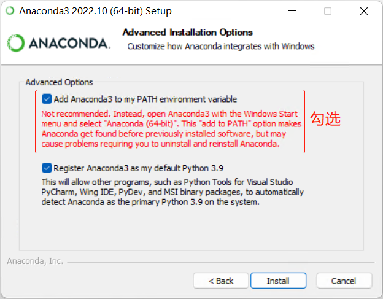
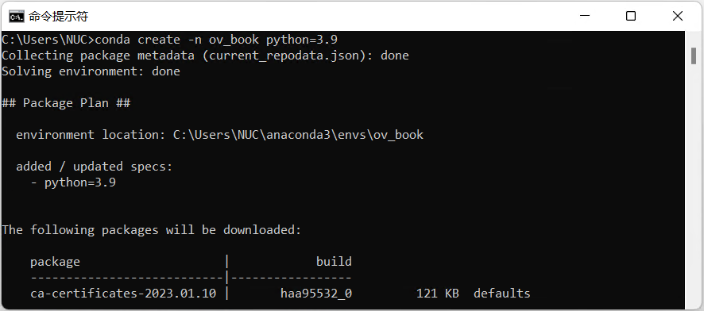
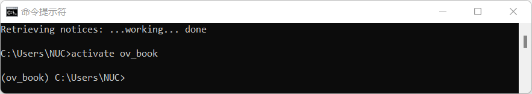
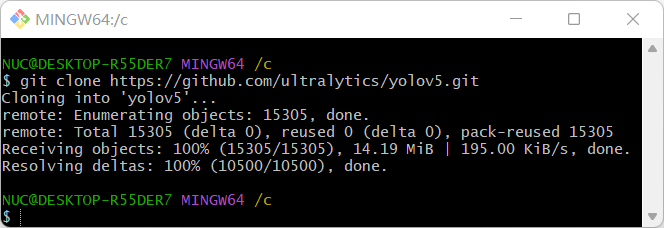
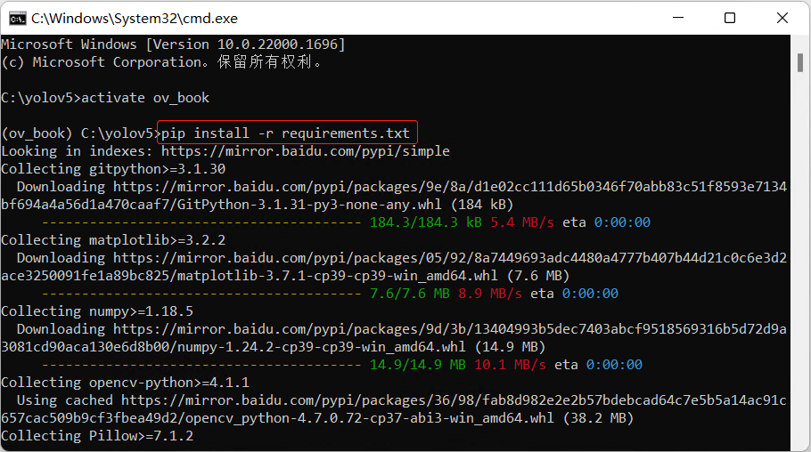
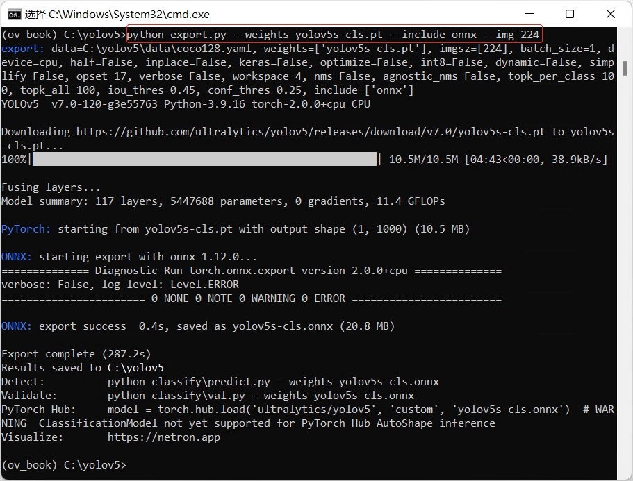

### 本文简介
本文讲述从零开始在Windows10/11上搭建OpenVINO+YOLOv5开发环境，包括：
+ 安装并配置Anaconda
+ 下载并安装Git
+ 克隆并安装YOLOv5
+ 安装openvino-dev
+ 安装VS Code

### 安装并配置Anaconda
#### 第一步，下载并安装Anaconda
Anaconda([官方网站](https://www.anaconda.com/))是Python软件包(packages)和虚拟环境(virtual environment)的管理工具，让Python开发者能方便快捷地管理Python运行的虚拟环境和开发应用程序所依赖的各种软件包。

从[Anaconda官网](https://www.anaconda.com/)下载最新的Anaconda安装文件，双击安装。

所有安装选项页面均保持默认选择，除了在高级安装选项(Advanced Installation Options)页， 请勾选“Add Anaconda to my PATH environment variable”，让Anaconda成为Windows系统默认的Python运行版本。

#### 第二步，配置Anaconda国内镜像源
参考[Anaconda 镜像使用帮助](https://mirrors.tuna.tsinghua.edu.cn/help/anaconda/)，完成Anaconda国内镜像源配置，这样可以极大的提高Python软件包的下载速度。

注意: Windows 用户无法直接创建名为 .condarc 的文件，可先执行 conda config --set show_channel_urls yes 生成该文件之后再修改

#### 第三步，创建并激活虚拟环境ov_book
打开**命令提示符** 窗口，输入命令更新当前conda
> conda update conda

输入命令创建名为“ov_book"的虚拟环境
> conda create -n ov_book python=3.9

激活ov_book虚拟环境
> activate ov_book

设置pip[百度镜像源](https://www.jianshu.com/p/4b34840f79dd),提高使用pip工具下载Python软件包的速度

### 下载并安装Git
Git是一个开源免费的分布式版本控制系统，不管是小项目还是大项目，都可以高效的管理。本书主要用Git工具从GitHub克隆项目代码仓，例如：[YOLOv5代码仓](https://github.com/ultralytics/yolov5)。

从[Git官网](https://git-scm.com/downloads)下载Git安装文件，按默认选项安装即可。

### 克隆并安装YOLOv5
第一步，启动Git Bash，将YOLOv5代码仓克隆到本地
>git clone https://github.com/ultralytics/yolov5.git

第二步，打开*命令提示符*窗口，激活ov_book虚拟环境，进入yolov5文件夹，安装YOLOv5所需的依赖软件包。
>activate ov_book
>pip install -r requirements.txt

第三步，导出yolov5s-cls ONNX格式模型
> python export.py --weights yolov5s-cls.pt --include onnx --img 224

### 安装openvino-dev

由于本书不涉及TensorFlow等框架，所以在安装时openvino-dev，增加一个onnx的选项，参考：https://pypi.org/project/openvino-dev/

>pip install openvino-dev[onnx]

### 安装VS Code
Visual Studio Code 是一款功能强大的代码编辑器，非常适合跟Anaconda和Git一起，作为Python程序的集成开发环境(IDE)。

从[VS Code官网](https://code.visualstudio.com/)下载安装文件，按照默认选项完成安装。

到此，完成了在Windows10/11上搭建OpenVINO+YOLOv5开发环境。

