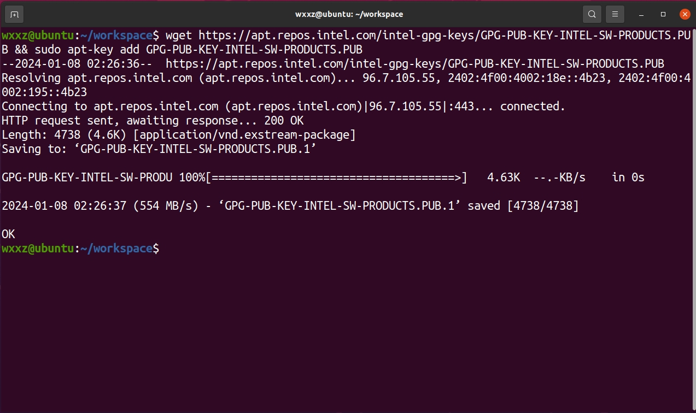
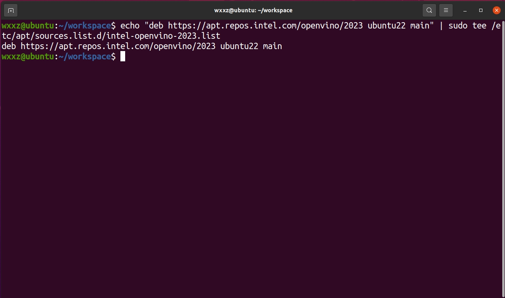
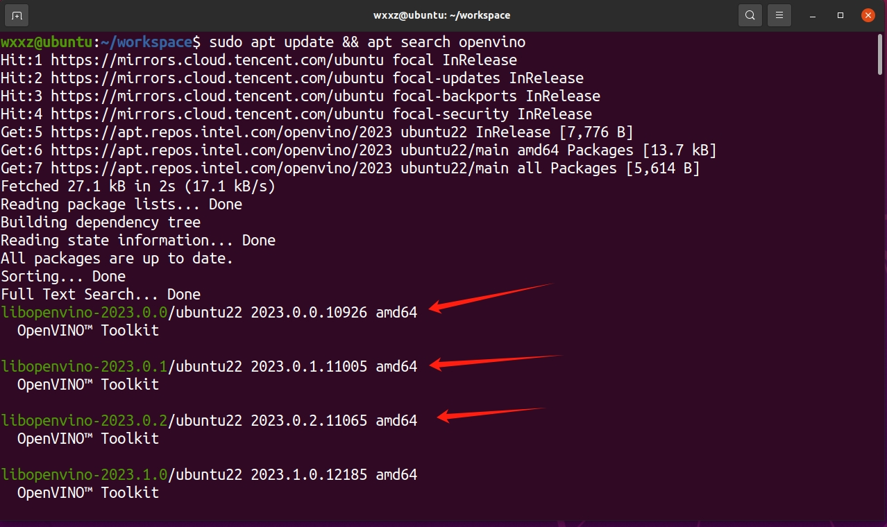
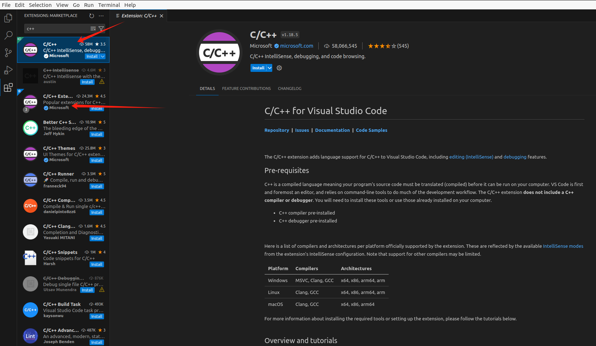
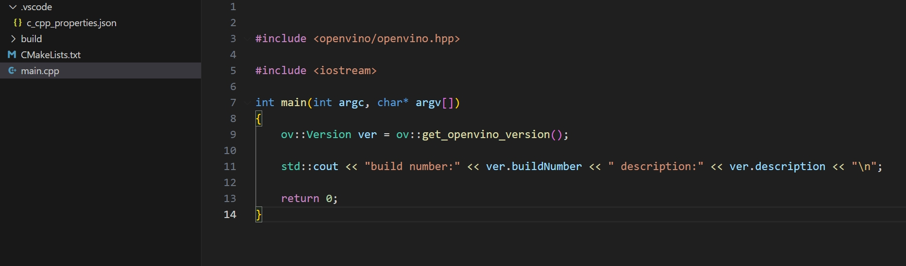
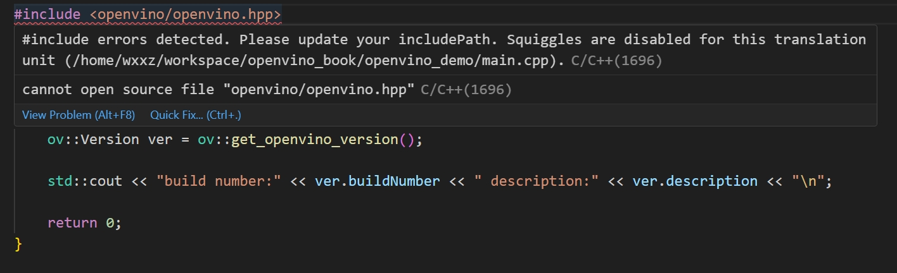

## 在Linux上搭建OpenVINO™CPP开发环境

- [在Linux上搭建OpenVINO™CPP开发环境](#在linux上搭建openvino™cpp开发环境)
  - [🧩简介](#🧩简介)
  - [🔮安装OpenVINO™开发环境(任选一个即可)](#🔮安装openvino™开发环境)
    - [方式一：使用APT包管理器安装](#使用apt包管理器安装)
    - [方式二：使用vcpkg安装](#使用vcpkg安装)
    
    
  - [🎈配置CPP开发环境](#🎈配置cpp开发环境)

  - [🎨创建并配置CPP项目](#🎨创建并配置cpp项目)
    - [第一步：创建OpenVINO™CPP项目](#第一步创建openvino™cpp项目)
    - [第二步：添加项目依赖](#第二步添加项目依赖)
  - [🎁测试OpenVINO™C#项目](#🎁测试openvino™cpp项目)
  - [🎯总结](#🎯总结)


### 🧩简介
本文将从零开始详述在**Linux(Ubuntu 22.04)**上搭建**OpenVINO™ CPlusPlus**开发环境，并对 **OpenVINO™ CPlusPlus API **环境进行简单测试。

### 🔮安装OpenVINO™开发环境

#### 使用APT包管理器安装

##### 步骤一
首先需要下载这个OpenVINO™的GPG公钥确保APT下载的是可信的来源, 并且将下载的密钥添加到系统中
```shell
wget https://apt.repos.intel.com/intel-gpg-keys/GPG-PUB-KEY-INTEL-SW-PRODUCTS.PUB && sudo apt-key add GPG-PUB-KEY-INTEL-SW-PRODUCTS.PUB
```
<div align=center></div>

##### 步骤二
通过以下命令添加存储库
```
echo "deb https://apt.repos.intel.com/openvino/2023 ubuntu22 main" | sudo tee /etc/apt/sources.list.d/intel-openvino-2023.list
```
<div align=center></div>


##### 步骤三
更新APT包列表,并且搜索是否存在OpenVINO™以验证是否添加存储库成功
```shell
sudo apt update && apt search openvino
```
如果显示存在结果如图所示即为成功添加到apt库中
<div align=center></div>

##### 步骤四
使用APT安装OpenVINO

```shell
sudo apt install openvino-2023.2.0
```

至此使用APT安装OpenVINO™就已经安装完成


#### 使用vcpkg安装

##### 步骤一
下载安装vcpkg C++库管理工具, 并且初始化环境变量
```shell
git clone https://github.com/microsoft/vcpkg.git
./vcpkg/bootstrap-vcpkg.sh
```

##### 步骤二
使用vcpkg命令安装OpenVINO™
```shell
vcpkg install openvino
```

### 🎈配置CPP开发环境
在Linux环境下我们可以使用以下组合进行C++代码开发：
- 代码构建工具：**CMake + make**
- 代码编译工具：**gcc**
- 代码编辑工具：**Visual Studio Code**
安装编译器以及相关工具
```shell
sudo apt install make cmake gcc g++ build-essential
```

**Visual Studio Code**安装比较简单，只需从[VS Code官网](https://code.visualstudio.com/)下载安装文件，按照默认选项完成安装。

然后配置C++编辑环境，在扩展商店中搜索C++，安装C++扩展，如下图所示。
<div align=center></div>


### 🎨创建并配置CPP项目
#### 第一步：创建OpenVINO™CPP项目
测试案例我们使用Visual Studio Code进行编辑并创建一个结构如下用于测试
<div align=center></div>


#### 第二步：添加项目依赖
在CMakeLists.txt中添加所需的依赖OpenVINO
```cmake
find_package(OpenVINO COMPONENTS Runtime)
target_link_libraries(
    ${PROJECT_NAME}
    PRIVATE
    openvino::runtime
)
```

***
<div align=center></div>

注：如果在vscode中发现有如上图类似这种报错,则是因为vscode的插件没有找到所安装的库头文件,我们需要手动将库的路径添加到这个c_cpp_properties.json 中的includePath中,比如我们使用apt默认安装openvino的路径在/usr/include/openvino, 那么我就需要添加/usr/include/**到vscode的配置文件中c_cpp_properties.json, 如下所示
```json
{
    "configurations": [
        {
            "name": "Linux",
            "includePath": [
                "${workspaceFolder}/**",
                "/usr/include/**"
            ],
            "defines": [],
            "intelliSenseMode": "linux-gcc-x64"
        }
    ],
    "version": 4
}
```

### 🎁测试OpenVINO™CPP项目

```C++
#include <openvino/openvino.hpp>
#include <iostream>

int main(int argc, char* argv[])
{
    ov::Version ver = ov::get_openvino_version();

    std::cout << "build number:" << ver.buildNumber << " description:" << ver.description << "\n";
    
    return 0;
}
```

运行结果如下则表示成功
```bash
./hello_openvino
build number:2023.2.0-13089-cfd42bd2cb0-HEAD description:OpenVINO Runtime
```

### 🎯总结
至此，我们就完成了在Linux上搭建OpenVINO™C++开发环境，欢迎大家使用，如需要更多信息，可以参考一下内容：

- [OpenVINO™](https://github.com/openvinotoolkit/openvino)
- [OpenVINO doc](https://docs.openvino.ai/2023.2/home.html)


