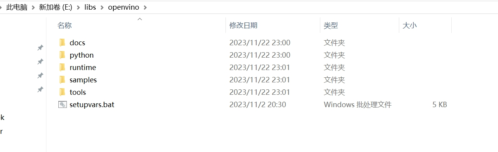
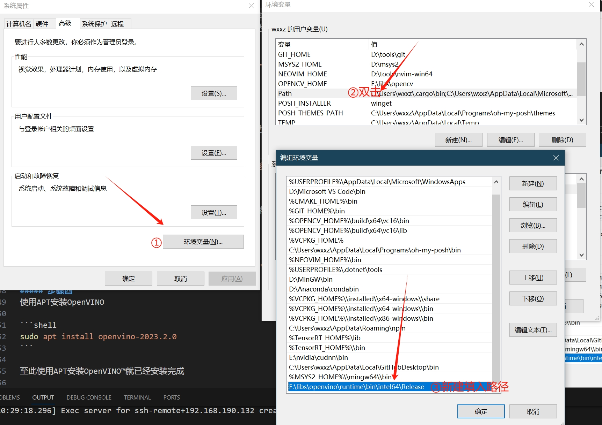
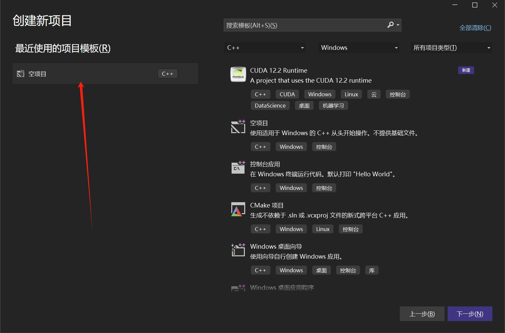
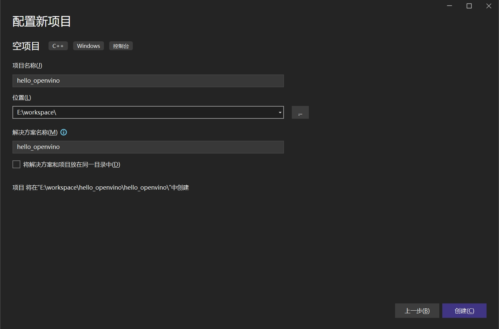
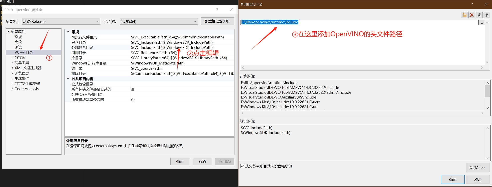
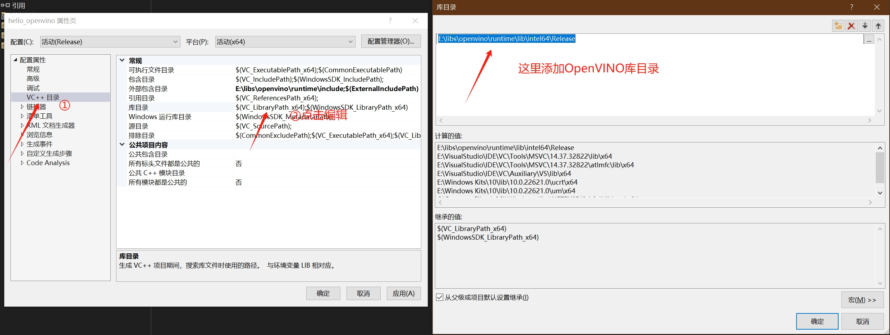
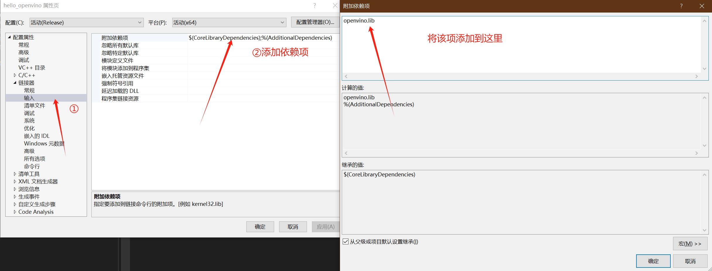

## 在Windows上搭建 OpenVINO™CPP开发环境

- [在Windows上搭建 OpenVINO™CPP开发环境](#在windows上搭建-openvinocpp开发环境)
  - [🧩简介](#简介)
  - [🔮安装开发环境](#安装开发环境)
    - [使用预编译库安装](#使用预编译库安装)
      - [步骤一](#步骤一)
      - [步骤二](#步骤二)
    - [使用vcpkg安装](#使用vcpkg安装)
      - [步骤一](#步骤一-1)
      - [步骤二](#步骤二-1)
  - [🎈配置CPP开发环境](#配置cpp开发环境)
  - [🎨创建并配置CPP项目](#创建并配置cpp项目)
    - [第一步：创建CPP项目](#第一步创建cpp项目)
    - [第二步：添加项目依赖](#第二步添加项目依赖)
  - [🎁测试](#测试)
  - [🎯总结](#总结)


### 🧩简介
本文将从零开始详述在**Window**上搭建**OpenVINO™ CPlusPlus**开发环境，并对 **OpenVINO™ CPlusPlus API **环境进行简单测试。

### 🔮安装开发环境

#### 使用预编译库安装

##### 步骤一
首先需要下载从官网下载[OpenVINO™](https://storage.openvinotoolkit.org/repositories/openvino/packages/2023.2/windows/w_openvino_toolkit_windows_2023.2.0.13089.cfd42bd2cb0_x86_64.zip)到任意目录后解压, 比如我将其放置到如下位置, 并且重命名为openvino

<div align=center></div>


##### 步骤二
将动态链接库的目录添加到系统环境变量以便运行时可以不用手动拷贝动态链接库到可执行文件目录

<div align=center></div>


#### 使用vcpkg安装

##### 步骤一
下载安装vcpkg C++库管理工具, 并且初始化环境变量
```shell
git clone https://github.com/microsoft/vcpkg.git
.\vcpkg\bootstrap-vcpkg.bat
```

##### 步骤二
使用vcpkg命令安装OpenVINO™
```shell
vcpkg install openvino
```


### 🎈配置CPP开发环境
在Windows环境下我们开发环境各式各样,但是对于c++开发不变的是,我们只需呀把头文件和库文件放置到构建系统的配置文件中即可。

在Linux中我们已经展示过如何使用VScode进行开发,在这里我们就给大家展示如何在Windows下配置Visual Studio进行开发
- 代码构建、编辑工具：**Visual Studio**
- 代码编译器: **MSVC**

这里我们假设已经完成Visual Studio的配置安装

### 🎨创建并配置CPP项目
#### 第一步：创建CPP项目
测试案例我们使用Visual Studio选择一个空项目
<div align=center></div>

将项目名称改为hello_openvino后点击创建即可创建完成一个visual studio项目
<div align=center></div>


#### 第二步：添加项目依赖
这里我们需要把openvino的头文件以及库文件都添加到刚刚创建的项目的配置文件里面。

首先点击菜单栏的**项目**，再点击**属性**按钮，会出现当前project的配置会话框。

将安装OpenVINO的头文件路径填入这里保存即可
<div align=center></div>
同样的也需要把这个lib目录添加到库目录中
<div align=center></div>

最后我们还需要将需要链接的库的名称填到输入项中(openvino.lib)
<div align=center></div>


### 🎁测试
创建一个main.cpp后输入以下代码, 右击项目点击生成即可在目录下生成可执行文件
```C++
#include <openvino/openvino.hpp>
#include <iostream>

int main(int argc, char* argv[])
{
    ov::Version ver = ov::get_openvino_version();

    std::cout << "build number:" << ver.buildNumber << " description:" << ver.description << "\n";
    
    return 0;
}
```

运行结果如下则表示成功
```bash
./hello_openvino
build number:2023.2.0-13089-cfd42bd2cb0-HEAD description:OpenVINO Runtime
```

### 🎯总结
至此，我们就完成了在Windows上搭建OpenVINO™C++开发环境，欢迎大家使用，如需要更多信息，可以参考一下内容：

- [OpenVINO™](https://github.com/openvinotoolkit/openvino)
- [OpenVINO™ doc](https://docs.openvino.ai/2023.2/home.html)


