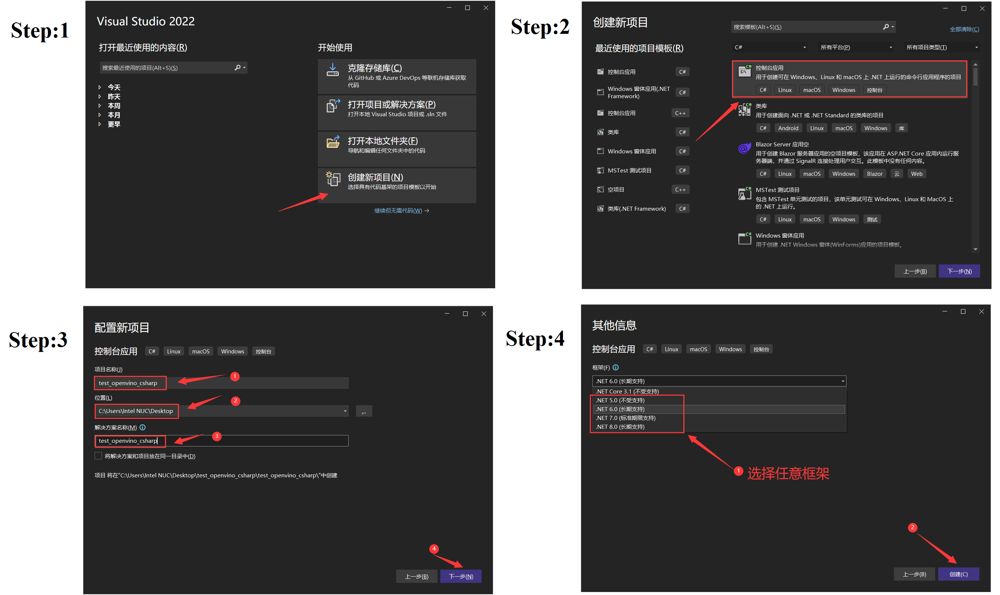
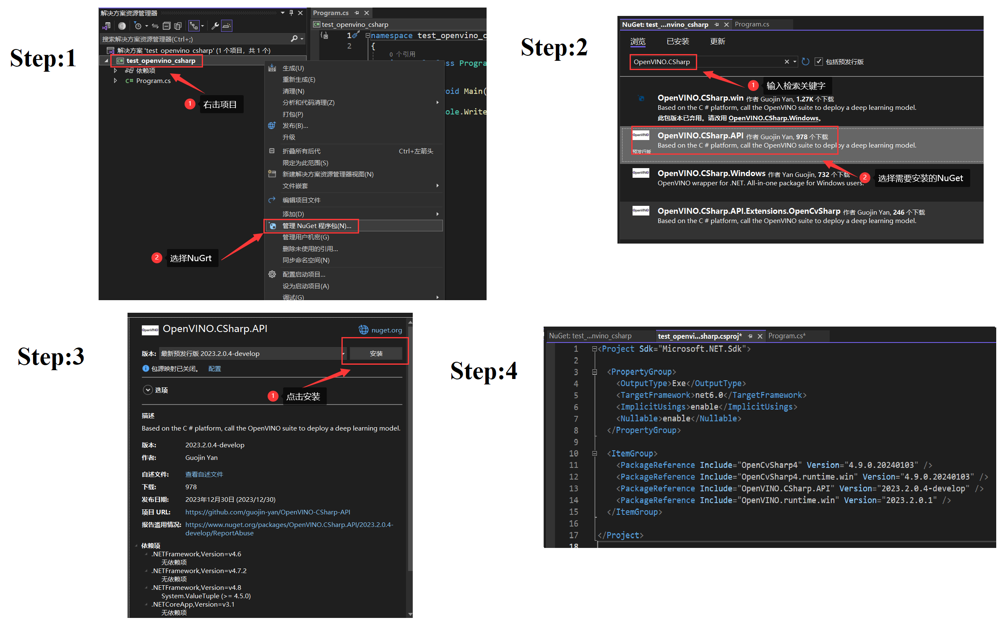

## 在Windows上搭建OpenVINO™ C#开发环境

- [在Windows上搭建OpenVINO™ C#开发环境](#在Windows上搭建OpenVINO™ C#开发环境)
  - [🧩简介](#🧩简介)
  - [🔮安装 .NET 运行环境](#🔮安装 .NET 运行环境)
  - [🎈配置C#开发环境](#🎈配置C#开发环境)
  - [🎨配置 OpenVINO™ C# 项目](#🎨配置 OpenVINO™ C# 项目)
    - [第一步：创建 OpenVINO™ C# 项目](#第一步：创建 OpenVINO™ C# 项目)
    - [第二步：添加项目依赖](#第二步：添加项目依赖)
    - [第三步：添加项目代码](#第三步：添加项目代码)
  - [🎁运行 OpenVINO™ C# 项目](#🎁运行 OpenVINO™ C# 项目)
  - [🎯总结](#🎯总结)


### 🧩简介

本文将从零开始详述在**Windows10/11**上搭建**OpenVINO™ CSharp**开发环境，并使用 **OpenVINO™ CSharp API **部署 **Yolov8s** 模型。

### 🔮安装 .NET 运行环境

**[.NET](https://learn.microsoft.com/zh-cn/dotnet/)** 是由 **Microsoft** 创建的一个免费的、跨平台的、开源开发人员平台，可以使用 C#、F# 或 Visual Basic 语言编写代码，用于构建许多不同类型的应用程序，可以在任何兼容的操作系统上(Windows、Linux、Mac OS等)运行。

 Microsoft官方提供了**.NET**环境的详细安装流程，大家可以参考以下文章进行安装：[在 Windows 上安装 .NET](https://learn.microsoft.com/zh-cn/dotnet/core/install/windows).

### 🎈配置C#开发环境

在Windows平台创建并编译C#代码可以使用的平台比较多，最容易使用以及最简单的是使用**Visual Studio IDE**，但是**Visual Studio IDE**目前只支持Windows环境，如果想实现跨平台使用，最好的组合为:

- 代码构建工具：**dotnet **
- 代码编辑工具：**Visual Studio Code**

所以在此处我们将讲解使用**Visual Studio IDE**方式编译并运行项目，在Linux以及MacOS系统中讲解使用**dotnet && Visual Studio Code **组合的方式。**Visual Studio IDE**安装方式可以参考Microsoft官方提供的安装教程：

- [Visual Studio 2022 IDE](https://visualstudio.microsoft.com/zh-hans/vs/)
- [在 Windows 上安装 .NET](https://learn.microsoft.com/zh-cn/dotnet/core/install/windows)

### 🎨配置 OpenVINO™ C# 项目

#### 第一步：创建 OpenVINO™ C# 项目

使用**Visual Studio 2022 IDE**创建一个 OpenVINO™  C# 测试项目，按照下图流程进行创建即可.

<div align=center></div>


#### 第二步：添加项目依赖

 OpenVINO™ C# 项目所使用的依赖环境，此处可以完全使用 NuGet Package 安装所需程序集，其安装流程如下图所示：

<div align=center></div>

在此处，主要需要安装两类 NuGet 程序包，分别为：

- **OpenVINO**
  - **OpenVINO.CSharp.API**：OpenVINO CSharp API 项目核心程序集。
  - **OpenVINO.CSharp.API.Extensions**：OpenVINO CSharp API 项目扩展接口程序集。
  - **OpenVINO.runtime.win**：OpenVINO 在Windows平台运行所需依赖项。

- **OpenCvSharp**
  - **OpenCvSharp4**：OpenCvSharp4 项目核心程序集。
  - **OpenCvSharp4.Extensions**：OpenCvSharp4项目扩展接口程序集。
  - **OpenCvSharp4.runtime.win**：OpenCvSharp4 在Windows平台运行所需依赖项。

#### 第三步：添加项目代码

使用 OpenVINO CSharp API 部署 Yolov8 模型全部项目代码已经上传到[OpenVINO-CSharp-API-Samples/model_samples/yolov8 ](https://github.com/guojin-yan/OpenVINO-CSharp-API-Samples/tree/master/model_samples/yolov8)，大家可以自行下载进行使用。为了防止初学者无法完整的复现该项目，所以此处摘出来了关键代码，可以直接实现使用 OpenVINO CSharp API 部署 Yolov8-det 模型模型，用户可以直接将下述代码替换到上文所创建的项目中的**Program.cs**文件中。

```csharp
using System.Runtime.InteropServices;
using OpenCvSharp;
using OpenCvSharp.Dnn;
using OpenVinoSharp;
using OpenVinoSharp.Extensions;
using OpenVinoSharp.Extensions.utility;
namespace test_openvino_csharp
{
    internal class Program
    {
        static void Main(string[] args)
        {
            string model_path = "";
            string image_path = "";
            string device = "AUTO";
            if (args.Length == 0)
            {
                if (!Directory.Exists("./model"))
                {
                    Directory.CreateDirectory("./model");
                }
                if (!File.Exists("./model/yolov8s.bin") && !File.Exists("./model/yolov8s.bin"))
                {
                    if (!File.Exists("./model/yolov8s.tar"))
                    {
                        _ = Download.download_file_async("https://github.com/guojin-yan/OpenVINO-CSharp-API-Samples/releases/download/Model/yolov8s.tar",
                            "./model/yolov8s.tar").Result;
                    }
                    Download.unzip("./model/yolov8s.tar", "./model/");
                }
                if (!File.Exists("./model/test_image.jpg"))
                {
                    _ = Download.download_file_async("https://github.com/guojin-yan/OpenVINO-CSharp-API-Samples/releases/download/Image/test_det_02.jpg",
                        "./model/test_image.jpg").Result;
                }
                model_path = "./model/yolov8s.xml";
                image_path = "./model/test_image.jpg";
            }
            else if (args.Length >= 2) 
            {
                model_path = args[0];
                image_path = args[1];
                device = args[2];
            }
            else 
            {
                Console.WriteLine("Please enter the correct command parameters, for example:");
                Console.WriteLine("> 1. dotnet run");
                Console.WriteLine("> 2. dotnet run <model path> <image path> <device name>");
            }
            // -------- Get OpenVINO runtime version --------

            OpenVinoSharp.Version version = Ov.get_openvino_version();

            Slog.INFO("---- OpenVINO INFO----");
            Slog.INFO("Description : " + version.description);
            Slog.INFO("Build number: " + version.buildNumber);

            Slog.INFO("Predict model files: " + model_path);
            Slog.INFO("Predict image  files: " + image_path);
            Slog.INFO("Inference device: " + device);
            Slog.INFO("Start yolov8 model inference.");

            yolov8_det(model_path, image_path, device);
        }
        static void yolov8_det(string model_path, string image_path, string device)
        {
            DateTime start = DateTime.Now;
            // -------- Step 1. Initialize OpenVINO Runtime Core --------
            Core core = new Core();
            DateTime end = DateTime.Now;
            Slog.INFO("1. Initialize OpenVINO Runtime Core success, time spend: " + (end-start).TotalMilliseconds + "ms.");
            // -------- Step 2. Read inference model --------
            start = DateTime.Now;
            Model model = core.read_model(model_path);
            end = DateTime.Now;
            Slog.INFO("2. Read inference model success, time spend: " + (end - start).TotalMilliseconds + "ms.");
            OvExtensions.printf_model_info(model);
            // -------- Step 3. Loading a model to the device --------
            start = DateTime.Now;
            CompiledModel compiled_model = core.compile_model(model, device);
            end = DateTime.Now;
            Slog.INFO("3. Loading a model to the device success, time spend:" + (end - start).TotalMilliseconds + "ms.");
            // -------- Step 4. Create an infer request --------
            start = DateTime.Now;
            InferRequest infer_request = compiled_model.create_infer_request();
            end = DateTime.Now;
            Slog.INFO("4. Create an infer request success, time spend:" + (end - start).TotalMilliseconds + "ms.");
            // -------- Step 5. Process input images --------
            start = DateTime.Now;
            Mat image = new Mat(image_path); // Read image by opencvsharp
            int max_image_length = image.Cols > image.Rows ? image.Cols : image.Rows;
            Mat max_image = Mat.Zeros(new OpenCvSharp.Size(max_image_length, max_image_length), MatType.CV_8UC3);
            Rect roi = new Rect(0, 0, image.Cols, image.Rows);
            image.CopyTo(new Mat(max_image, roi));
            float factor = (float)(max_image_length / 640.0);
            end = DateTime.Now;
            Slog.INFO("5. Process input images success, time spend:" + (end - start).TotalMilliseconds + "ms.");
            // -------- Step 6. Set up input data --------
            start = DateTime.Now;
            Tensor input_tensor = infer_request.get_input_tensor();
            Shape input_shape = input_tensor.get_shape();
            Mat input_mat = CvDnn.BlobFromImage(max_image, 1.0 / 255.0, new OpenCvSharp.Size(input_shape[2], input_shape[3]), 0, true, false);
            float[] input_data = new float[input_shape[1] * input_shape[2] * input_shape[3]];
            Marshal.Copy(input_mat.Ptr(0), input_data, 0, input_data.Length);
            input_tensor.set_data<float>(input_data);

            end = DateTime.Now;
            Slog.INFO("6. Set up input data success, time spend:" + (end - start).TotalMilliseconds + "ms.");
            // -------- Step 7. Do inference synchronously --------
            infer_request.infer();
            start = DateTime.Now;
            infer_request.infer();
            end = DateTime.Now;
            Slog.INFO("7. Do inference synchronously success, time spend:" + (end - start).TotalMilliseconds + "ms.");
            // -------- Step 8. Get infer result data --------
            start = DateTime.Now;
            Tensor output_tensor = infer_request.get_output_tensor();
            int output_length = (int)output_tensor.get_size();
            float[] output_data = output_tensor.get_data<float>(output_length);
            end = DateTime.Now;
            Slog.INFO("8. Get infer result data success, time spend:" + (end - start).TotalMilliseconds + "ms.");

            // -------- Step 9. Process reault  --------
            start = DateTime.Now;
            Mat result_data = new Mat(84, 8400, MatType.CV_32F, output_data);
            result_data = result_data.T();

            // Storage results list
            List<Rect> position_boxes = new List<Rect>();
            List<int> class_ids = new List<int>();
            List<float> confidences = new List<float>();
            // Preprocessing output results
            for (int i = 0; i < result_data.Rows; i++)
            {
                Mat classes_scores = new Mat(result_data, new Rect(4, i, 80, 1));
                OpenCvSharp.Point max_classId_point, min_classId_point;
                double max_score, min_score;
                // Obtain the maximum value and its position in a set of data
                Cv2.MinMaxLoc(classes_scores, out min_score, out max_score,
                    out min_classId_point, out max_classId_point);
                // Confidence level between 0 ~ 1
                // Obtain identification box information
                if (max_score > 0.25)
                {
                    float cx = result_data.At<float>(i, 0);
                    float cy = result_data.At<float>(i, 1);
                    float ow = result_data.At<float>(i, 2);
                    float oh = result_data.At<float>(i, 3);
                    int x = (int)((cx - 0.5 * ow) * factor);
                    int y = (int)((cy - 0.5 * oh) * factor);
                    int width = (int)(ow * factor);
                    int height = (int)(oh * factor);
                    Rect box = new Rect();
                    box.X = x;
                    box.Y = y;
                    box.Width = width;
                    box.Height = height;

                    position_boxes.Add(box);
                    class_ids.Add(max_classId_point.X);
                    confidences.Add((float)max_score);
                }
            }
            // NMS non maximum suppression
            int[] indexes = new int[position_boxes.Count];
            CvDnn.NMSBoxes(position_boxes, confidences, 0.5f, 0.5f, out indexes);

            end = DateTime.Now;
            Slog.INFO("9. Process reault  success, time spend:" + (end - start).TotalMilliseconds + "ms."); 
            for (int i = 0; i < indexes.Length; i++)
            {
                int index = indexes[i];
                Cv2.Rectangle(image, position_boxes[index], new Scalar(0, 0, 255), 2, LineTypes.Link8);
                Cv2.Rectangle(image, new OpenCvSharp.Point(position_boxes[index].TopLeft.X, position_boxes[index].TopLeft.Y + 30),
                    new OpenCvSharp.Point(position_boxes[index].BottomRight.X, position_boxes[index].TopLeft.Y), new Scalar(0, 255, 255), -1);
                Cv2.PutText(image, class_ids[index] + "-" + confidences[index].ToString("0.00"),
                    new OpenCvSharp.Point(position_boxes[index].X, position_boxes[index].Y + 25),
                    HersheyFonts.HersheySimplex, 0.8, new Scalar(0, 0, 0), 2);
            }
            string output_path = Path.Combine(Path.GetDirectoryName(Path.GetFullPath(image_path)),
                Path.GetFileNameWithoutExtension(image_path) + "_result.jpg");
            Cv2.ImWrite(output_path, image);
            Slog.INFO("The result save to " + output_path);
            Cv2.ImShow("Result", image);
            Cv2.WaitKey(0);
        }
    }
}
```


### 🎁运行 OpenVINO™ C# 项目

创建并配置好项目后，就可以直接运行该项目了，使用**Visual Studio 2022 IDE**可以直接点击运行案件运行程序，程序运行后输出如下所示：

```shell
<00:00:00> Sending http request to https://github.com/guojin-yan/OpenVINO-CSharp-API-Samples/releases/download/Model/yolov8s.tar.
<00:00:01> Http Response Accquired.
<00:00:01> Total download length is 21.62 Mb.
<00:00:01> Download Started.
<00:00:01> File created.
<00:01:21> Downloading: [■■■■■■■■■■] 100% <00:01:21 0.27 Mb/s> 21.62 Mb/21.62 Mb downloaded.
<00:01:21> File Downloaded, saved in C:\Users\Intel NUC\Desktop\test_openvino_csharp\test_openvino_csharp\bin\Debug\net6.0\model\yolov8s.tar.
<00:00:00> Sending http request to https://github.com/guojin-yan/OpenVINO-CSharp-API-Samples/releases/download/Image/test_det_02.jpg.
<00:00:01> Http Response Accquired.
<00:00:01> Total download length is 0.16 Mb.
<00:00:01> Download Started.
<00:00:01> File created.
<00:00:02> Downloading: [■■■■■■■■■■] 100% <00:00:02 0.06 Mb/s> 0.16 Mb/0.16 Mb downloaded.
<00:00:02> File Downloaded, saved in C:\Users\Intel NUC\Desktop\test_openvino_csharp\test_openvino_csharp\bin\Debug\net6.0\model\test_image.jpg.
[ INFO ] ---- OpenVINO INFO----
[ INFO ] Description : OpenVINO Runtime
[ INFO ] Build number: 2023.2.0-13089-cfd42bd2cb0-HEAD
[ INFO ] Predict model files: ./model/yolov8s.xml
[ INFO ] Predict image  files: ./model/test_image.jpg
[ INFO ] Inference device: AUTO
[ INFO ] Start yolov8 model inference.
[ INFO ] 1. Initialize OpenVINO Runtime Core success, time spend: 6.7601ms.
[ INFO ] 2. Read inference model success, time spend: 34.9634ms.
[ INFO ] Inference Model
[ INFO ]   Model name: torch_jit
[ INFO ]   Input:
[ INFO ]      name: images
[ INFO ]      type: float
[ INFO ]      shape: Shape : {1,3,640,640}
[ INFO ]   Output:
[ INFO ]      name: output0
[ INFO ]      type: float
[ INFO ]      shape: Shape : {1,84,8400}
[ INFO ] 3. Loading a model to the device success, time spend:784.9361ms.
[ INFO ] 4. Create an infer request success, time spend:0.6423ms.
[ INFO ] 5. Process input images success, time spend:60.6686ms.
[ INFO ] 6. Set up input data success, time spend:19.9202ms.
[ INFO ] 7. Do inference synchronously success, time spend:87.8603ms.
[ INFO ] 8. Get infer result data success, time spend:2.9166ms.
[ INFO ] 9. Process reault  success, time spend:20.0242ms.
[ INFO ] The result save to C:\Users\Intel NUC\Desktop\test_openvino_csharp\test_openvino_csharp\bin\Debug\net6.0\model\test_image_result.jpg
```

输出分为两个部分：

- 第一部分为下载模型文件以及预测图片文件，此处主要是为了减少初学者的任务量，无需再自己导出Yolov8模型，如果用户想导出Yolov8模型，可以参考[ultralytics](https://github.com/ultralytics/ultralytics)项目进行模型导出。
- 第二部分是模型推理流程输出，此处主要是输出了模型相关信息以及模型推理流程所需时间，最后将模型推理结果战术出来并保存到本地，模型推理结果如下图所示。

<div align=center></div>

### 🎯总结

至此，我们就完成了使用**OpenVINO™ CSharp API **部署 **Yolov8s** 模型，欢迎大家使用，如需要更多信息，可以参考一下内容：

- [OpenVINO™](https://github.com/openvinotoolkit/openvino)
- [OpenVINO CSharp API](https://github.com/guojin-yan/OpenVINO-CSharp-API)

- [OpenVINO CSharp API Samples](https://github.com/guojin-yan/OpenVINO-CSharp-API-Samples)