## 在Windows上搭建 OpenVINO™ GenAI CPP项目

- 在Windows上搭建 OpenVINO™ GenAI CPP项目
  - [🧩简介](#🧩简介)
  - [🐌模型准备](#🐌模型准备)
    - [-环境配置](#-环境配置)
    - [-下载模型](#-下载模型)
    - [-模型转换与量化](#-模型转换与量化)
  - [🔮安装开发环境](#🔮安装开发环境)
  - [🎈C++项目配置](#🎈C++项目配置)
    - [第一步：创建CPP项目](#第一步：创建CPP项目)
    - [第二步：添加项目依赖](#第二步：添加项目依赖)
  - [🎁模型推理代码](#🎁模型推理代码)
  - [👏效果演示](#👏效果演示)
  - [🎯总结](#🎯总结)

### 🧩简介

&emsp;    本文将从零开始详述在**Window**上搭建**OpenVINO™ GenAI CPlusPlus**开发环境，并对 **OpenVINO™ GenAI CPlusPlus API **环境进行简单测试。或者快速参考[《在Windows中基于Visual Studio配置OpenVINO C++开发环境》](https://mp.weixin.qq.com/s/USN5UGsONanzTp-JNfHtuA)

### 🐌模型准备

#### -环境配置

&emsp;    模型下载与转换需要使用的Python环境，因此此处我们采用Anaconda，然后用下面的命令创建并激活名为optimum_intel的虚拟环境：

```
conda create -n optimum_intel python=3.11     #创建虚拟环境
conda activate optimum_intel     #激活虚拟环境
python -m pip install --upgrade pip     #升级pip到最新版本
```

&emsp;    由于Optimum Intel代码迭代速度很快，所以选用从源代码安装的方式，安装Optimum Intel和其依赖项OpenVINO与NNCF。

```
python -m pip install "optimum-intel[openvino,nncf]"@git+https://github.com/huggingface/optimum-intel.git
```

####  -下载模型

&emsp;    目前一些大语言模型发布在Hugging Face上，但由于在国内我们很难访问，因此此处模型下载我们使用国内的魔塔社区进行模型下载：

&emsp;    首先下载``Qwen1.5-7B-Chat-GPTQ-Int4``大模型，输入以下命令即可进行下载：

```
git clone https://www.modelscope.cn/qwen/Qwen1.5-7B-Chat-GPTQ-Int4.git
```

&emsp;    接着下载``TinyLlama-1.1B-Chat-v1.0``大模型，输入以下命令即可进行下载：

```
git clone https://www.modelscope.cn/AI-ModelScope/TinyLlama-1.1B-Chat-v1.0.git
```

&emsp;    输入上面命令后，输出如下面所示，则说明已经完成了模型下载：

<div align=center>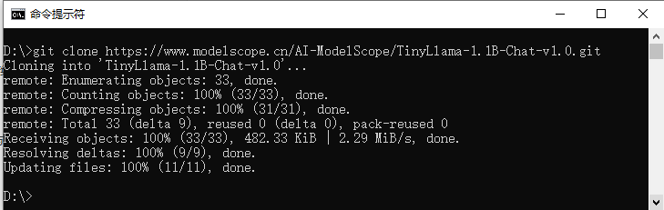</div>

&emsp;    然后我们查看一下下载后的文件夹，如下图所示，文件中已经包含了下载的大模型以及一些配置文件：

<div align=center>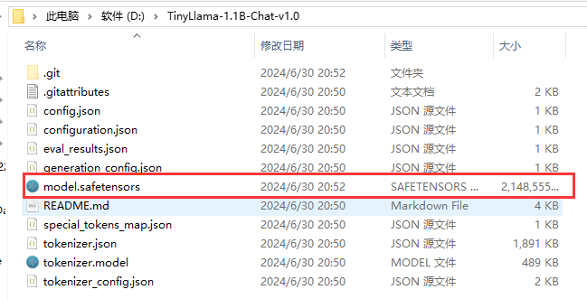</div>

#### -模型转换与量化

&emsp;    最后我们使用Optimum Intel工具，将模型转为OpenVINO™ 的IR格式，同时为了提升模型推理速度，我们还将模型进行INT4量化，此处我们可以使用Optimum Intel工具一条指令便可完成。

首先进行``Qwen1.5-7B-Chat-GPTQ-Int4``模型的转换与量化，在上文创建的环境下输入以下命令即可：

```
optimum-cli export openvino --trust-remote-code --model D:\Qwen1.5-7B-Chat-GPTQ-Int4  --task text-generation-with-past --weight-format int4 --sym Qwen1.5-7B-Chat-GPTQ-Int4
```

> 错误提醒：在转换的时候如果出现``PackageNotFoundError: No package metadata was found for auto-gptq``的错误，请输入以下指令安装缺失的程序包：
>
> ```
> pip install auto-gptq
> ```

&emsp;    然后进行``TinyLlama-1.1B-Chat-v1.0``模型的转换与量化，在上文创建的环境下输入以下命令即可：


```
optimum-cli export openvino --model D:\TinyLlama-1.1B-Chat-v1.0 --task text-generation-with-past --weight-format int4 --sym TinyLlama-1.1B-Chat-v1.0
```

&emsp;    模型转换完成后输出如下所示：

<div align=center>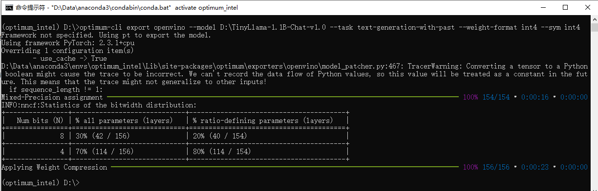</div>

&emsp;    转换完成后，我们查看一下模型路径，可以看到模型路径下多了三个转换好的OpenVINO™ 的IR格式文件，如下图所示：

<div align=center>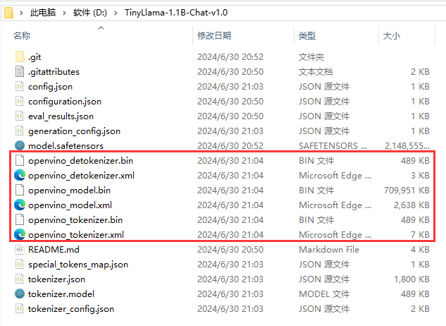</div>

&emsp;    到此为止我们已经完成了模型的准备与转换环节。

### 🔮安装开发环境

&emsp;    首先访问下面链接，进入下载页面：

```
https://www.intel.com/content/www/us/en/developer/tools/openvino-toolkit/download.html
```

&emsp;    然后再下载页面选择相应的包以及环境，然后点击下载链接进行下载，如下图所示：

<div align=center>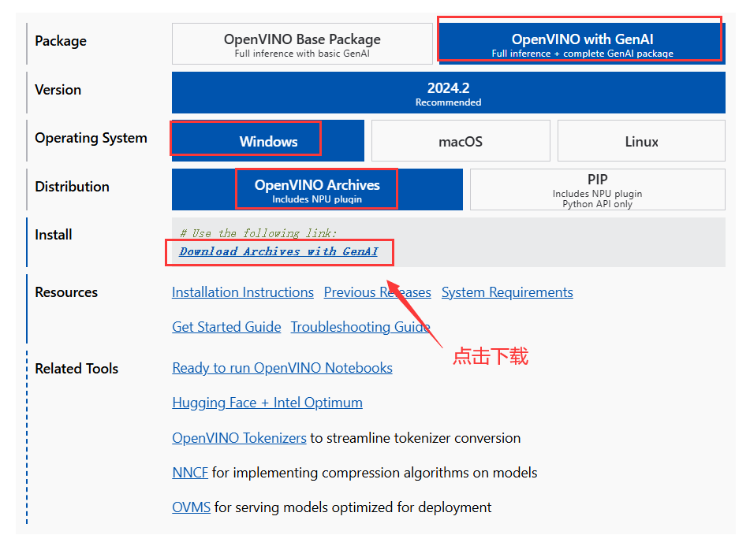</div>

&emsp;    文件下载完成后，将其解压到任意目录，此处建议解压到``C:\Program Files (x86)\Intel``目录下，并将文件夹名修改为较为简洁表述，如下图所示：

<div align=center>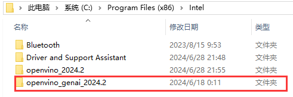</div>

&emsp;    最后在环境变量PATH中添加以下路径：

```
C:\Program Files (x86)\Intel\openvino_genai_2024.2\runtime\bin\intel64\Debug
C:\Program Files (x86)\Intel\openvino_genai_2024.2\runtime\bin\intel64\Release
C:\Program Files (x86)\Intel\openvino_genai_2024.2\runtime\3rdparty\tbb\bin
```

至此为止，我们便完成了OpenVINO™ GenAI 下载与安装。

### 🎈C++项目配置

&emsp;    C++项目我们使用Visual Studio创建，具体创建方式此处不做详述。主要是需要配置包含目录、库目录以及附加依赖项，分别在C++项目中依次进行配置就可以。

#### 第一步：创建CPP项目

测试案例我们使用Visual Studio选择一个空项目

<div align=center></div>

将项目名称改为hello_openvino后点击创建即可创建完成一个visual studio项目

<div align=center></div>


#### 第二步：添加项目依赖

&emsp;    这里我们需要把OpenVINO™的头文件以及库文件都添加到刚刚创建的项目的配置文件里面。

&emsp;    首先点击菜单栏的**项目**，再点击**属性**按钮，会出现当前project的配置会话框。

- 包含目录：

  包含目录设置内容如下所示，在VC++中设置包含目录内容，操作如下图所示：

```
# Debug和Release
C:\Program Files (x86)\Intel\openvino_genai_2024.2\runtime\include
C:\Program Files (x86)\Intel\openvino_genai_2024.2\runtime\include\openvino\genai
C:\Program Files (x86)\Intel\openvino_genai_2024.2\runtime\include\openvino
```

<div align=center>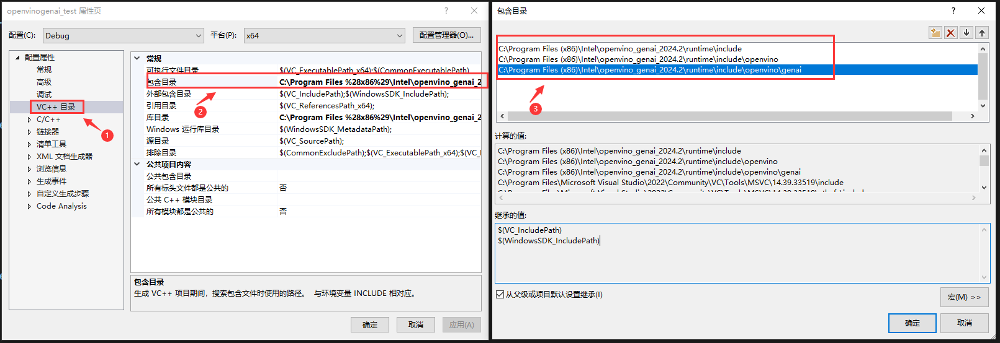</div>

- 库目录：

  库目录设置内容如下所示，在VC++中设置库目录内容，操作如下图所示：

```
# Debug
C:\Program Files (x86)\Intel\openvino_genai_2024.2\runtime\lib\intel64\Debug
# Release
C:\Program Files (x86)\Intel\openvino_genai_2024.2\runtime\lib\intel64\Release
```

<div align=center>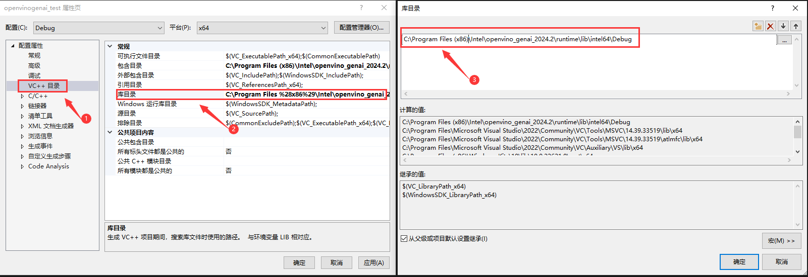</div>


- 附加依赖项

  附加依赖项设置内容如下所示，在VC++中设置附加依赖项内容，操作如下图所示：

```
# Debug
openvinod.lib
openvino_genaid.lib
# Release
openvino.lib
openvino_genai.lib
```

<div align=center>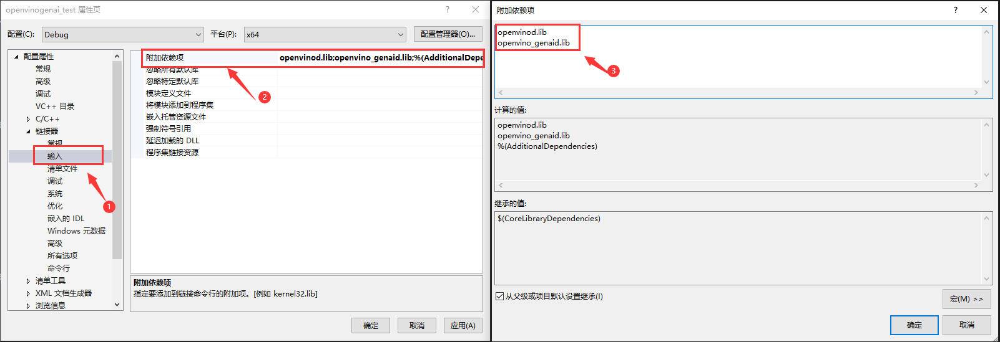</div>

### 🎁模型推理代码

&emsp;    下面是模型推理的代码，由于OpenVINO™ GenAI已经将模型的前后处理流程进行了封装，因此在使用时代码十分简洁，如些所示：

```c++
#include "openvino/genai/llm_pipeline.hpp"
#include <iostream>
int main(int argc, char* argv[])
{
    std::string model_path = "D:\\model\\TinyLlama-1.1B-Chat-v1.0";
    std::string prompt;
    ov::genai::LLMPipeline pipe(model_path, "CPU");
    ov::genai::GenerationConfig config;
    config.max_new_tokens = 1000;
    std::function<bool(std::string)> streamer = [](std::string word) {
        std::cout << word << std::flush;
        return false;
    };

    pipe.start_chat();
    for (;;) {
        std::cout << "question:\n";
        std::getline(std::cin, prompt);
        if (prompt == "Stop!")
            break;
        pipe.generate(prompt, config, streamer);
        std::cout << "\n----------\n";
    }
    pipe.finish_chat();
}
```

### 👏效果演示

&emsp;    在运行代码后，我们想起进行提问“Please generate a C # code to implement matrix transpose”，主要是让其生成一段C #代码，实现矩阵的转置，输出如下所示：

<div align=center>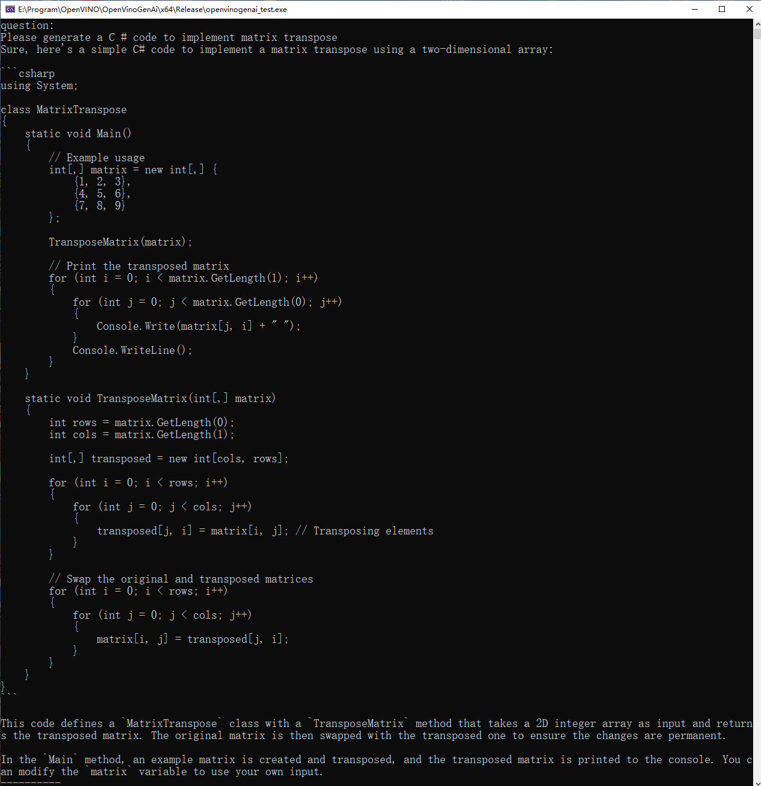</div>

&emsp;    同时我们查看一下运行过程中CPU以及内存情况，下图是CPU以及内存占用情况：

|                        CPU占用                         |                        内存占用                        |
| :----------------------------------------------------: | :----------------------------------------------------: |
| 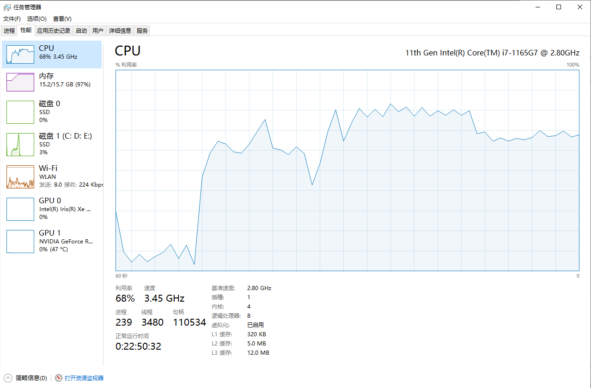 | 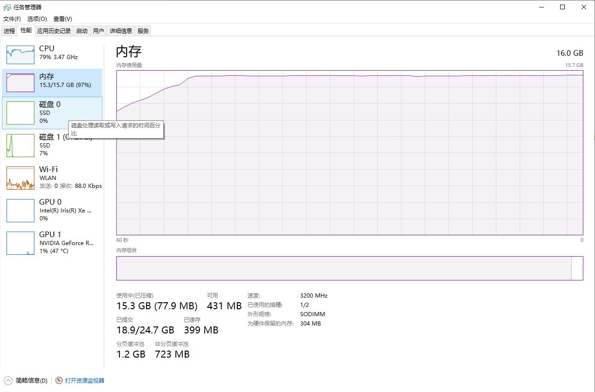 |

&emsp;    本机电脑使用的是一块16GB的内存，可以看出在OpenVINO的加持下，依然可以很流畅的使用大语言模型进行推理。

### 🎯总结

&emsp;    至此，我们就完成了在Windows上搭建OpenVINO™C++开发环境，欢迎大家使用，如需要更多信息，可以参考一下内容：

- [OpenVINO™](https://github.com/openvinotoolkit/openvino)
- [OpenVINO™ doc](https://docs.openvino.ai/2023.2/home.html)

