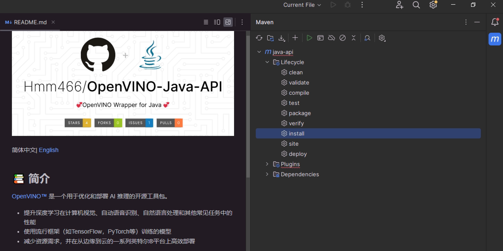
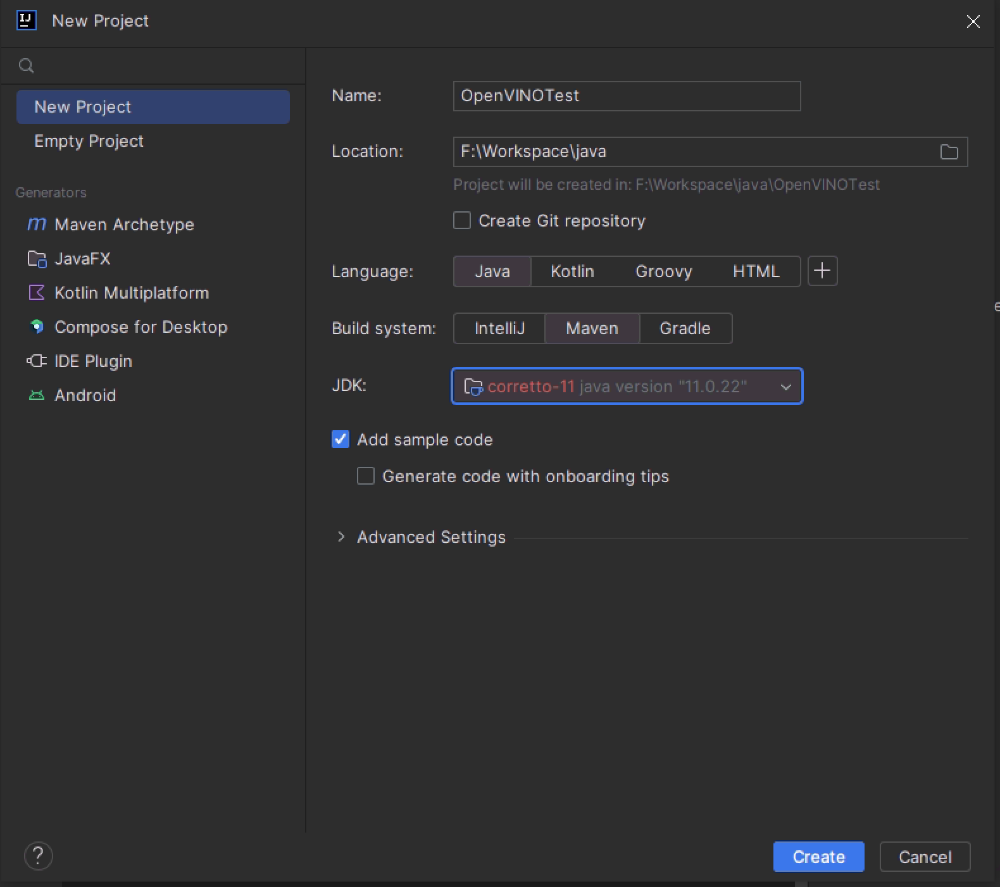
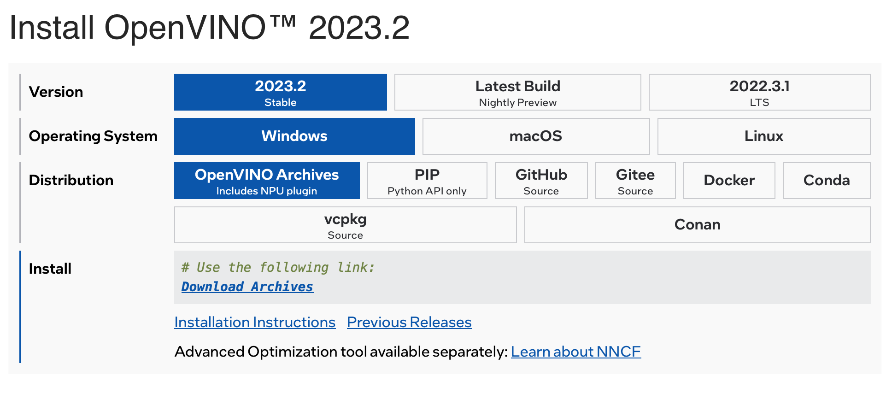
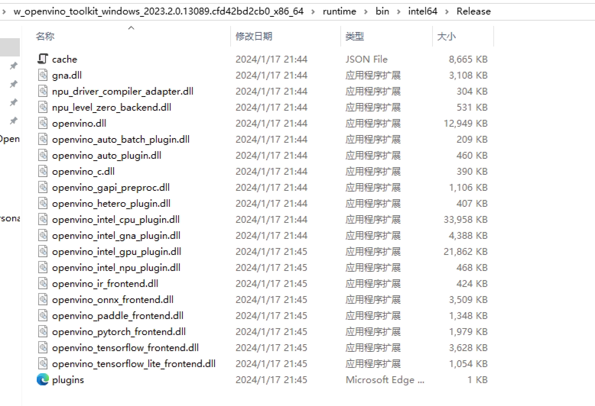
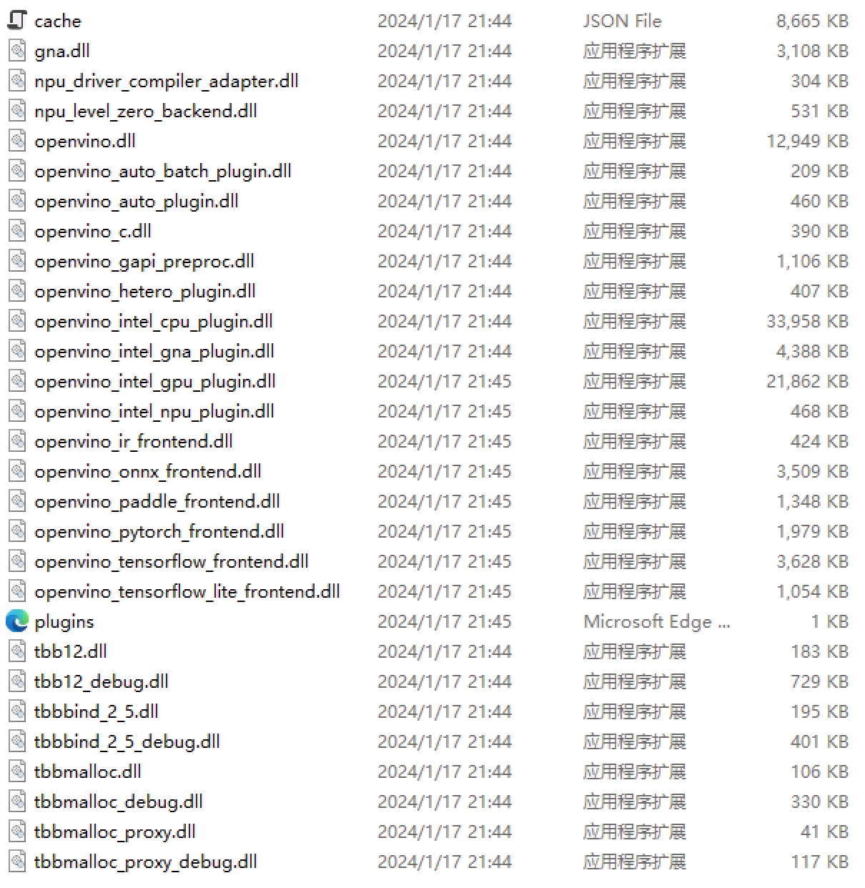

## 在Windows上搭建OpenVINO™ Java开发环境

- [在Windows上搭建OpenVINO™ Java开发环境](#在Windows上搭建OpenVINO™ Java开发环境)
  - [🧩简介](#🧩简介)
  - [🔮安装Java运行环境](#🔮安装Java运行环境)
  - [🎈配置Java开发环境](#🎈配置Java开发环境)
  - [🎯编译OpenVINO™ Java API到本地](🎯编译OpenVINO™JavaAPI到本地)
  - [🎨创建并配置Java项目](#🎨创建并配置Java项目)
    - [第一步创建一个Java-Maven项目](#第一步创建一个Java-Maven项目)
    - [第二步添加OpenVINO™ Java API 到Maven项目中](#第二步添加OpenVINO™JavaAPI到Maven项目中)
    - [第三步下载OpenVINO Runtime](#第三步下载OpenVINORuntime)
    - [第四步解压缩，并将tbb的dll 拷贝到runtime下](#第四步解压缩，并将tbb的dll拷贝到runtime下)
  - [🎁测试OpenVINO™ Java项目](#🎁测试OpenVINO™Java项目)
  - [🎯总结](#🎯总结)


### 🧩简介

本文将从零开始详述在**Windows**平台上上搭建**OpenVINO™ Java**开发环境，并使用Java语言 来对**OpenVINO™ Java API **环境进行简单测试，并验证其可行性。

### 🔮安装Java运行环境

Java是一门面向对象的编程语言，不仅吸收了C++语言的各种优点，还摒弃了C++里难以理解的多继承、指针等概念，因此Java语言具有功能强大和简单易用两个特征。Java语言作为静态面向对象编程语言的代表，极好地实现了面向对象理论，允许程序员以优雅的思维方式进行复杂的编程。我们可以在Oracle 的**[Java SE](https://www.oracle.com/cn/java/)**页面进行下载，建议从Java 11开始

JDK（Java Development Kit）称为Java开发包或Java开发工具，是一个编写Java的Applet小程序和应用程序的程序开发环境。JDK是整个Java的核心，包括了Java运行环境（Java Runtime Environment），一些Java工具和Java的核心类库（Java API）。不论什么Java应用服务器实质都是内置了某个版本的JDK。主流的JDK是Sun公司发布的JDK，除了Sun之外，还有很多公司和组织都开发了自己的JDK.

基本步骤：
- 下载Java11 Windows版本的压缩包(也可以在IDEA中下载)
- 解压到一个正确的目录，最好是英文目录
- 配置环境变量

具体可以搜索网上安装Java JDK的教程

### 🎈配置Java开发环境

对于Java开发而言，开发工具相对而言比较多，如Eclipse、VS Code、IntelliJ IDEA，而相对体验而言，本篇文章将使用IntelliJ IDEA - 社区版本作为主要开发工具，当然大家可以使用自己喜欢的IDE进行开发，同时由于IntelliJ IDEA 具备Maven的功能，所以我们可以直接进行测试。而本篇文章将采用一下组合进行开发：
- JDK: Oracle Java11
- Maven
- IDE: IntelliJ IDEA

工具下载地址：
- [Oracle Java]()
- [Maven]()
- [IntelliJ IDEA 社区版]()

### 🎯编译OpenVINO™ Java API到本地
由于[OpenVINO™ Java API]()目前没有上传到Maven中央仓库，所以需要手动编译和安装到本地的maven环境中。

- 下载[OpenVINO™ Java API]() 源代码到本地
- 通过IDEA 打开项目
- 通过Maven 工具install到本地

日志将输出：
```
[INFO] Installing F:\OpenVINO-Java-API-main\pom.xml to C:\Users\xxxx\.m2\repository\org\openvino\java-api\1.0-SNAPSHOT\java-api-1.0-SNAPSHOT.pom
[INFO] Installing F:\OpenVINO-Java-API-main\target\java-api-1.0-SNAPSHOT.jar to C:\Users\ming\.m2\repository\org\openvino\java-api\1.0-SNAPSHOT\java-api-1.0-SNAPSHOT.jar
[INFO] ------------------------------------------------------------------------
[INFO] BUILD SUCCESS
[INFO] ------------------------------------------------------------------------
[INFO] Total time:  3.771 s
[INFO] Finished at: 2024-01-20T15:54:17+08:00
[INFO] ------------------------------------------------------------------------
[WARNING] 
[WARNING] Plugin validation issues were detected in 2 plugin(s)
[WARNING] 
[WARNING]  * org.apache.maven.plugins:maven-compiler-plugin:3.10.1
[WARNING]  * org.apache.maven.plugins:maven-resources-plugin:3.3.0
[WARNING] 
[WARNING] For more or less details, use 'maven.plugin.validation' property with one of the values (case insensitive): [BRIEF, DEFAULT, VERBOSE]
[WARNING] 

Process finished with exit code 0
```
### 🎨创建并配置Java项目
#### 第一步创建一个Java-Maven项目
由于我们使用的IDE是IntelliJ IDEA，所以我们直接创建一个maven项目并打开


#### 第二步添加OpenVINO™ Java API 到maven项目中
```xml
<dependency>
    <groupId>org.openvino</groupId>
    <artifactId>java-api</artifactId>
    <version>1.0-SNAPSHOT</version>
</dependency>
```

#### 第三步下载OpenVINORuntime
OpenVINO™ 有两种安装方式: OpenVINO™ Runtime 和OpenVINO™ Development Tools。OpenVINO™ Runtime 包含用于在处理器设备上运行模型部署推理的核心库。OpenVINO™ Development Tools 是一组用于处理 OpenVINO™ 和 OpenVINO™ 模型的工具，包括模型优化器、OpenVINO™ Runtime、模型下载器等。在此处我们只需要安装 OpenVINO™ Runtime 即可。

访问 [Download the Intel Distribution of OpenVINO™ Toolkit](https://docs.openvino.ai/2023.2/openvino_docs_install_guides_overview.html) 页面，按照下面流程选择相应的安装选项，在下载页面，由于AIxBoard使用的是 Ubuntu20.04，因此下载时按照指定的编译版本下载即可(截止2024年1月17日release版本是2023.2)。


进入到下载页面直接下载w_openvino_toolkit_windows_2023.2.0.13089.cfd42bd2cb0_x86_64.zip 即可

#### 第四步解压缩，并将tbb的dll拷贝到runtime下
- w_openvino_toolkit_windows_2023.2.0.13089.cfd42bd2cb0_x86_64\runtime\3rdparty\tbb\bin
- 拷贝至w_openvino_toolkit_windows_2023.2.0.13089.cfd42bd2cb0_x86_64\runtime\bin\intel64\Release

原：


拷贝后：


### 🎁测试OpenVINO™Java项目
创建一个Main.java后输入以下代码, 右击项目点击生成即可在目录下生成可执行文件
```Java
package org.example;

import org.openvino.java.OpenVINO;
import org.openvino.java.domain.OvVersion;
import org.openvino.java.utils.Console;

public class Main {
    public static void main(String[] args) {
        System.out.println("Hello OpenVINO!");
        OpenVINO vino = OpenVINO.load("F:\\w_openvino_toolkit_windows_2023.2.0.13089.cfd42bd2cb0_x86_64\\runtime\\bin\\intel64\\Release\\openvino_c.dll");
        OvVersion version = vino.getVersion();
        Console.println("---- OpenVINO INFO----");
        Console.println("Description : %s", version.description);
        Console.println("Build number: %s", version.buildNumber);
    }
}
```

运行结果如下则表示成功
```bash
Hello OpenVINO!
---- OpenVINO INFO----
Description : OpenVINO Runtime
Build number: 2023.2.0-13089-cfd42bd2cb0-HEAD
```

### 🎯总结
至此，我们就完成了在Windows上搭建OpenVINO™ Java开发环境，欢迎大家使用，如需要更多信息，可以参考一下内容：

- [OpenVINO™](https://github.com/openvinotoolkit/openvino)
- [OpenVINO doc](https://docs.openvino.ai/2023.2/home.html)
- [OpenVINO™ Java API](https://github.com/Hmm466/OpenVINO-Java-API)