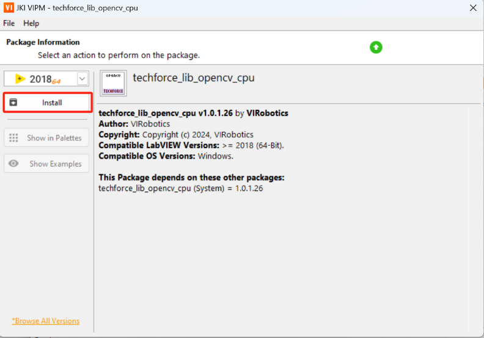
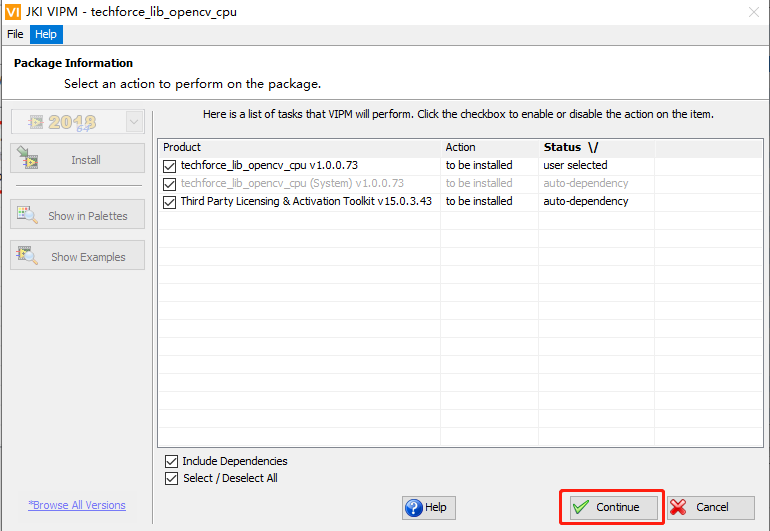
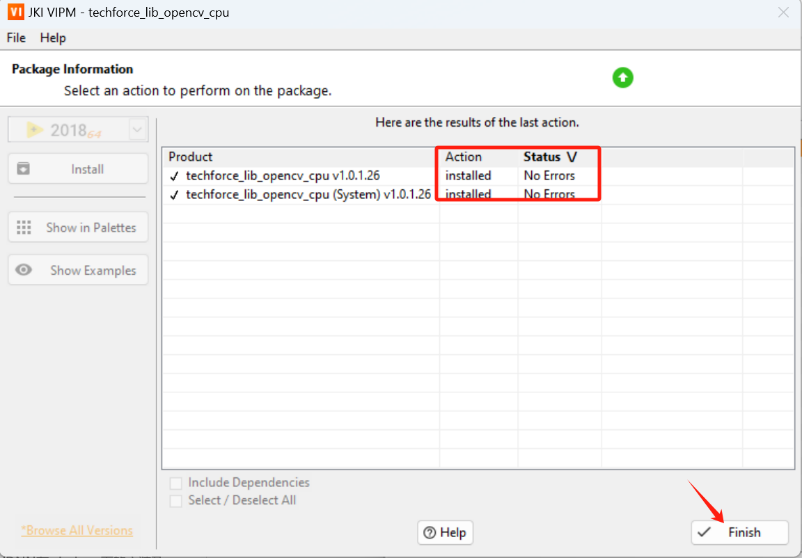
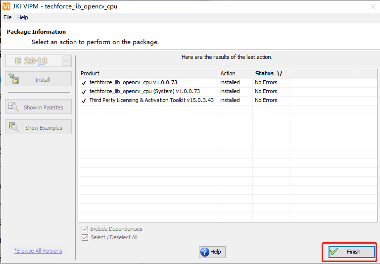
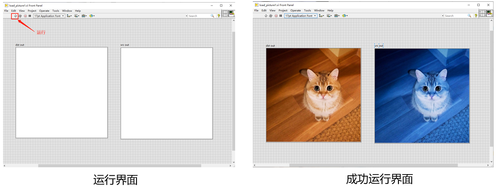
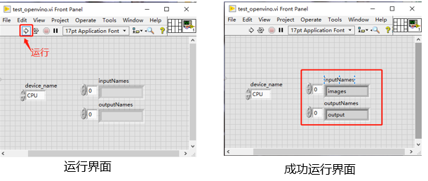

## 在Windows上搭建OpenVINO™ LabVIEW开发环境

- [在Windows上搭建OpenVINO™ LabVIEW开发环境](#在windows上搭建openvino-labview开发环境)
  - [1 简介](#1-简介)
  - [2 软件安装](#2-软件安装)
    - [2.1 环境搭建](#21-环境搭建)
    - [2.2 准备工作](#22-准备工作)
      - [2.2.1 安装LabVIEW 2018(64位)或更高版本](#221-安装labview-201864位或更高版本)
      - [2.2.2 LabVIEW AI视觉工具包安装说明](#222-labview-ai视觉工具包安装说明)
      - [2.2.3 工具包成功安装测试](#223-工具包成功安装测试)
      - [2.2.4 常见报错解决办法](#224-常见报错解决办法)
    - [2.3 LabVIEW AI Toolkit-OpenVINO™安装说明](#23-labview-ai-toolkit-openvino安装说明)
      - [2.3.1 工具包安装步骤](#231-工具包安装步骤)
      - [2.3.2 工具包成功安装测试](#232-工具包成功安装测试)
      - [2.3.3 常见报错解决办法](#233-常见报错解决办法)
  - [3 联系我们](#3-联系我们)
  - [4 总结](#4-总结)

### 1 简介

**LabVIEW AI Toolkit-OpenVINO™**是我们（VIRobotics团队）开发的一款AI推理加速工具包，整个工具包作为**LabVIEW**的插件，旨在帮助用户提高工作效率和推理速度。使用者可以在**LabVIEW**中直接使用**OpenVINO™**实现在**CPU、GPU(intel)、FPGA、VPU**等硬件上的部署和推理。

本文将从零开始详述**在Windows10/11上搭建OpenVINO™ LabVIEW开发环境**，并对 **OpenVINO™ LabVIEW**环境进行简单测试。

### 2 软件安装
#### 2.1 环境搭建

- 操作系统：**Windows系统**
- **LabVIEW**：2018及以上 64位版本
- **VIPM** ：2021及以上版本
- **AI视觉工具包**（techforce_lib_opencv_cpu）：1.0.1.16及以上版本

#### 2.2 准备工作

##### 2.2.1 安装LabVIEW 2018(64位)或更高版本
本司的所有视觉相关的工具包，均支持2018或更高版本64位LabVIEW,如果您电脑已经安装了2018 或更高版本64位LabVIEW，则可跳过本步骤，无需重复安装。若还未安装，请从https://www.ni.com/zh-cn/support/downloads/software-products/download.labview.html ，下载**LabVIEW**安装文件。需要注意的是：请选择2018及以上的**LabVIEW 64位**版本，并勾选**Vision Development**模块和**NI-IMAQdx**。

##### 2.2.2 LabVIEW AI视觉工具包安装说明

1、在下载链接： https://pan.baidu.com/s/1cedsCy2ylc0-7XBPloWrtg?pwd=yiku 中下载文件夹 “LabVIEW AI视觉工具包”，文件中包含工具包安装包和测试范例。
2、双击安装包【techforce_lib_opencv_cpu-xxx.vip】，进入VIPM安装环境，点击Install开始安装； 

3、安装需要一点时间，等待即可；

4、如下图所示，均显示为No Errors即成功安装，点击Finish即可；

5、成功安装后打开**LabVIEW**并新建**VI**，在程序框图面板Block Diagram (记得是程序框图面板，不是前面板哦)中鼠标右键-->点击**Addons**-->可以看到附加工具包Addons中多了一项"**VIRobotics**"-->点击**VIRobotics**-->点击函数选版**opencv_yiku**，可以找到我们刚刚安装好的工具包中所有的机器视觉相关函数，至此**LabVIEW AI视觉工具包CPU版安装完成**。

##### 2.2.3 工具包成功安装测试

在“\LabVIEW AI视觉工具包\LabVIEW AI视觉工具包测试范例”中，双击load_picrure1.vi，点击运行，能够出现成功运行界面，即AI视觉工具包成功安装并可正常使用

##### 2.2.4 常见报错解决办法

如不能出现成功运行界面，请先确保电脑当前已正常联网；还是报错则需要下载并安装 vc runtime

下载链接：https://pan.baidu.com/s/1_ynhbfHbWiQHfTBJ33zSKA?pwd=yiku 

双击运行VC_redist.x64.exe安装vc_runtime

#### 2.3 LabVIEW AI Toolkit-OpenVINO™安装说明

##### 2.3.1 工具包安装步骤
1、在下载链接：链接：https://pan.baidu.com/s/1F7-W5A0vLE6suPg3HPZZvQ?pwd=yiku 中，下载文件 “LabVIEW AI Toolkit-OpenVINO™”，文件中包含工具包安装包和测试范例。 

2、以管理员身份打开VIPM，双击安装包【virobotics_lib_openvino-xxx.vip】，进入VIPM安装环境，点击Install开始安装，安装过程会自动安装并配置OpenVINO™驱动；

3、安装过程会弹出cmd黑框，如下图所示时，点击回车即可；

4、安装需要几分钟，等待一会，出现如下界面，均显示为No Errors即成功安装，点击Finish即可。

##### 2.3.2 工具包成功安装测试

1、在“\ LabVIEW AI Toolkit-OpenVINO™\test_examples”中，将test_openvino文件夹**放到不包含中文的路径下**；

2、双击test_openvino.vi，点击运行，能够出现成功运行界面，即OpenVINO™成功安装并可正常使用，若无法使用，请查看下一页解决方法。

##### 2.3.3 常见报错解决办法
1、范例显示如下错误。

解决办法：建议先**完全关闭LabVIEW**，然后重新打开相关范例，如还报同样的错误，请确定以下路径已经添加到系统环境变量Path中。

C:\ProgramData\VIRobotics\driver\OpenVINO\bin\intel64\Release

C:\ProgramData\VIRobotics\driver\OpenVINO\3rdparty\tbb\bin

2、范例运行报错解决办法：

- 确保电脑当前已正常联网；
- 确保test_openvino文件夹放到了不包含中文的路径下；
- 确保已经安装LabVIEW AI Toolkit-OpenVINO™，如未安装，请先安装；
- 查看是否有如下文件路径： C:\ProgramData\VIRobotics\driver\OpenVINO；
- 如有以上路径，请先完全关闭labview，然后将以下两个路径添加到系统环境变量中：
  C:\ProgramData\VIRobotics\driver\OpenVINO\bin\intel64\Release C:\ProgramData\VIRobotics\driver\OpenVINO\3rdparty\tbb\bin
- 重新运行范例，即可成功。

### 3 联系我们

如有任何需求帮助，可根据以下方式联系我们。

**上海仪酷智能科技有限公司（VIRobotics）**

**公司创始人：王立奇**

微信号：wangstoudamire

**添加微信请备注**：intel_OpenVINO

**微信公众号**：VIRobotics

**官网**：https://www.virobotics.net/

**邮箱**：info@virobotics.net

如您想要探讨更多关于LabVIEW与人工智能技术，欢迎加入我们的技术交流群：705637299。进群请备注：intel_OpenVINO

### 4 总结

至此，我们就完成了在Windows上搭建OpenVINO™ LabVIEW开发环境，欢迎大家使用，如需要更多信息，可以参考一下内容：

-  [LabVIEW AI开发者福音：LabVIEW OpenVINO™ AI加速工具包，不来看看？](https://mp.weixin.qq.com/s/G1mw_yawlQ96JG5g14pSRg)

- [AI for Science：OpenVINO™ + 英特尔显卡解薛定谔方程｜开发者实战](https://mp.weixin.qq.com/s/yKHx260O2y4Q10KYx9UNHA)
