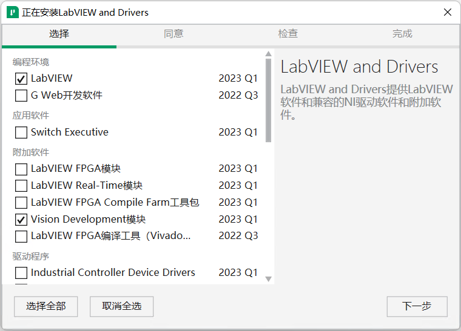
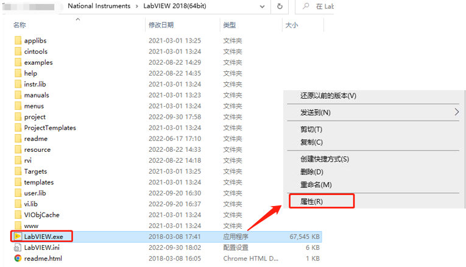
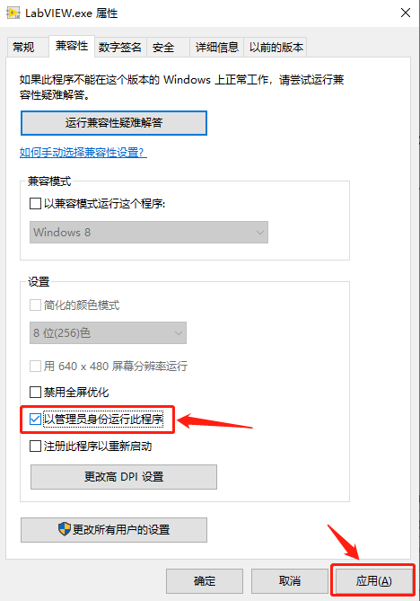
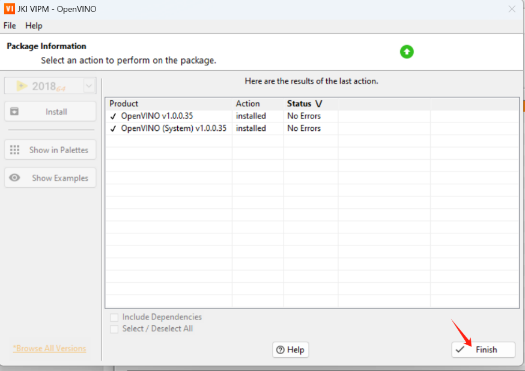
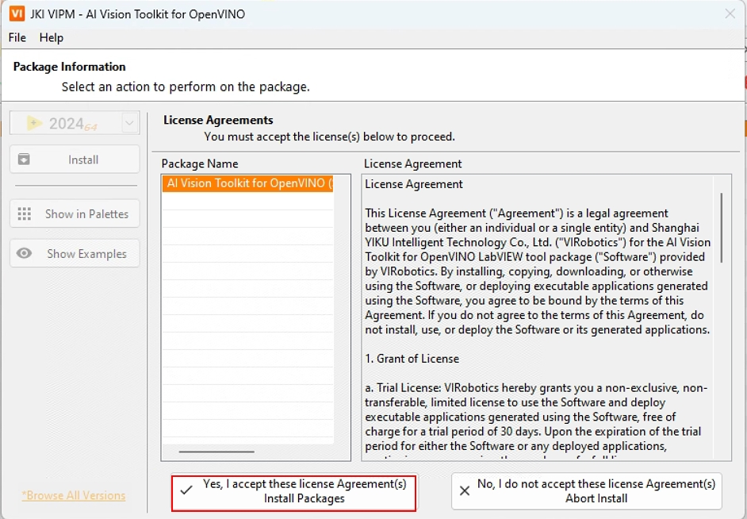
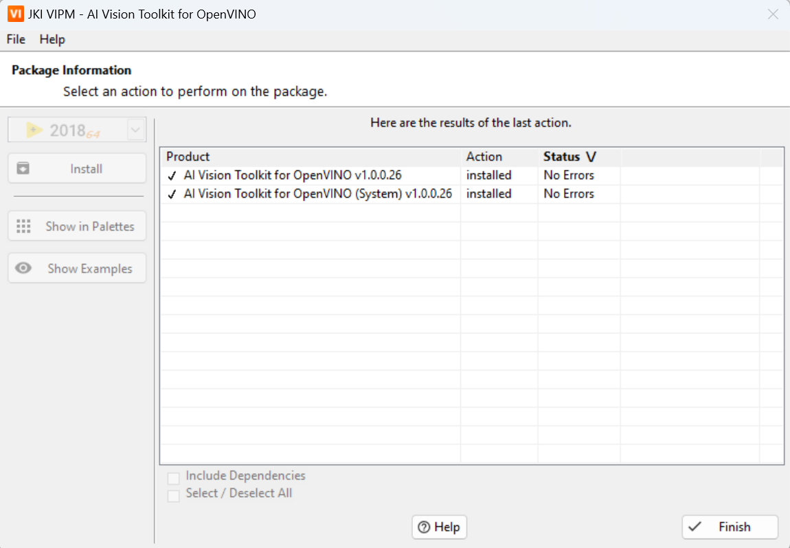
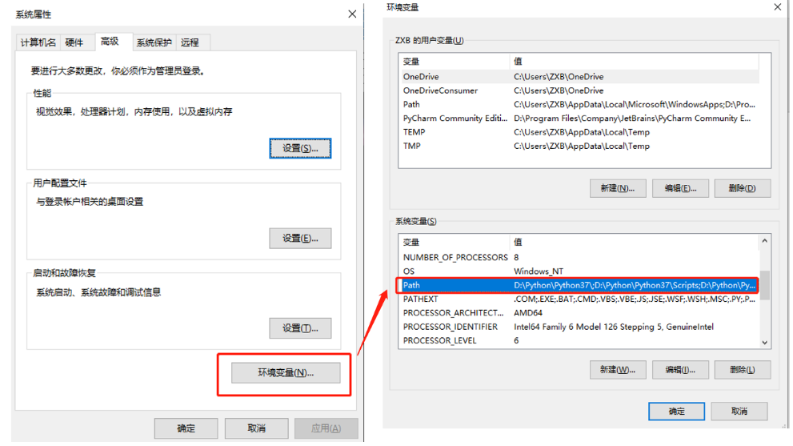
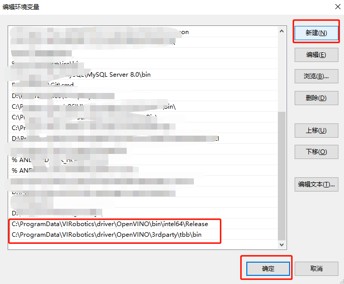

## 在Windows上搭建OpenVINO™ LabVIEW开发环境

- [在Windows上搭建OpenVINO™ LabVIEW开发环境](#在windows上搭建openvino-labview开发环境)
  - [1 简介](#1-简介)
  - [2 软件安装](#2-软件安装)
    - [2.1 环境搭建](#21-环境搭建)
    - [2.2 准备工作](#22-准备工作)
      - [2.2.1 安装LabVIEW 2018(64位)或更高版本](#221-安装labview-201864位或更高版本)
    - [2.3 AI Vision Toolkit for OpenVINO安装说明](#23-ai-vision-toolkit-for-openvino安装说明)
      - [2.3.1 工具包安装步骤](#231-工具包安装步骤)
      - [2.3.2 常见报错解决办法](#232-常见报错解决办法)
  - [3 联系我们](#3-联系我们)
  - [4 总结](#4-总结)

### 1 简介

**AI Vision Toolkit for OpenVINO**（以下简称**AIVT-OV**），由VIRobotics（仪酷智能）**专为LabVIEW开发的独立工具包**，旨在充分利用OpenVINO™的深度学习和计算机视觉优化功能。该工具包提供高级别的API，使开发者能够快速构建、配置和部署图像处理和视觉识别应用的深度神经网络，帮助开发者更快地将应用落地。

本文将从零开始详述**在Windows10/11上搭建OpenVINO™ LabVIEW开发环境**，并对 **OpenVINO™ LabVIEW**环境进行简单测试。

### 2 软件安装
#### 2.1 环境搭建

- **操作系统**：Windows 10（x64）及以上版本
- **LabVIEW**：2018（64位）及以上版本。
- **VIPM** ：2021及以上版本

#### 2.2 准备工作

##### 2.2.1 安装LabVIEW 2018(64位)或更高版本
本司的所有视觉相关的工具包，均支持2018或更高版本64位LabVIEW,如果您电脑已经安装了2018 或更高版本64位LabVIEW，则可跳过本步骤，无需重复安装。若还未安装，请从https://www.ni.com/zh-cn/support/downloads/software-products/download.labview.html ，下载**LabVIEW**安装文件。需要注意的是：请选择2018及以上的**LabVIEW 64位**版本，并勾选**Vision Development**模块和**NI-IMAQdx**。

#### 2.3 AI Vision Toolkit for OpenVINO安装说明

##### 2.3.1 工具包安装步骤
1. 关闭电脑中的所有安全防护软件；

2. 下载**AIVT-OV**：**以管理员身份运行VIPM**，在VIPM中搜索关键字：AI Vision Toolkit ，可以找到工具包安装包，如下图所示；

   （注意：如果你不想在VIPM中下载AIVT-OV，可以在此[链接](https://bj11112.apps.aliyunfile.com/s/rxf91TXEC3Y)中下载）

3. 双击“ai_vision_toolkit_for_openvino”，点击Install;

4. 此时开始下载该工具包

5. 选择接受许可协议；

6. 如下图所示即安装完毕，点击Finish即可；

到这里您已经使用VIPM成功安装了**AIVT-OV**，现在您可以在LabVIEW中开始您的深度学习旅程了。

如果您在安装过程中遇到任何问题或有任何疑问，请联系我们的支持团队寻求帮助。联系邮箱：support@virobotics.net

注：**AIVT-OV**工具包不断更新， 最新发行说明可在VIPM中搜索。

##### 2.3.2 常见报错解决办法
1、使用过程范例发生报错，请先确保电脑当前已正常联网；还是报错则需要下载并安装 vc runtime

下载链接：https://pan.baidu.com/s/1_ynhbfHbWiQHfTBJ33zSKA?pwd=yiku 

双击运行VC_redist.x64.exe安装vc_runtime

2、范例显示如下错误。

解决办法：建议先**完全关闭LabVIEW**，然后重新打开相关范例，如还报同样的错误，请确定以下路径已经添加到系统环境变量Path中。

C:\ProgramData\VIRobotics\driver\OpenVINO\bin\intel64\Release

C:\ProgramData\VIRobotics\driver\OpenVINO\3rdparty\tbb\bin

3、范例运行报错解决办法：

- 确保电脑当前已正常联网；
- 确保test_openvino文件夹放到了不包含中文的路径下；
- 确保已经安装**AIVT-OV**工具包，如未安装，请先安装；
- 查看是否有如下文件路径： C:\ProgramData\VIRobotics\driver\OpenVINO；
- 如有以上路径，请先完全关闭labview，然后将以下两个路径添加到系统环境变量中：
  C:\ProgramData\VIRobotics\driver\OpenVINO\bin\intel64\Release 
  C:\ProgramData\VIRobotics\driver\OpenVINO\3rdparty\tbb\bin
- 重新运行范例，即可成功。

### 3 联系我们

如有任何需求帮助，可根据以下方式联系我们。

**上海仪酷智能科技有限公司（VIRobotics）**

**公司创始人：王立奇**

微信号：wangstoudamire

**添加微信请备注**：intel_OpenVINO

**微信公众号**：VIRobotics

**官网**：https://www.virobotics.net/

**邮箱**：info@virobotics.net

如您想要探讨更多关于LabVIEW与人工智能技术，欢迎加入我们的技术交流群：705637299。进群请备注：intel_OpenVINO

### 4 总结

至此，我们就完成了在Windows上搭建OpenVINO™ LabVIEW开发环境，欢迎大家使用，如需要更多信息，可以参考以下内容：

-  [LabVIEW AI开发者福音：LabVIEW OpenVINO™ AI加速工具包，不来看看？](https://mp.weixin.qq.com/s/G1mw_yawlQ96JG5g14pSRg)

- [AI for Science：OpenVINO™ + 英特尔显卡解薛定谔方程｜开发者实战](https://mp.weixin.qq.com/s/yKHx260O2y4Q10KYx9UNHA)