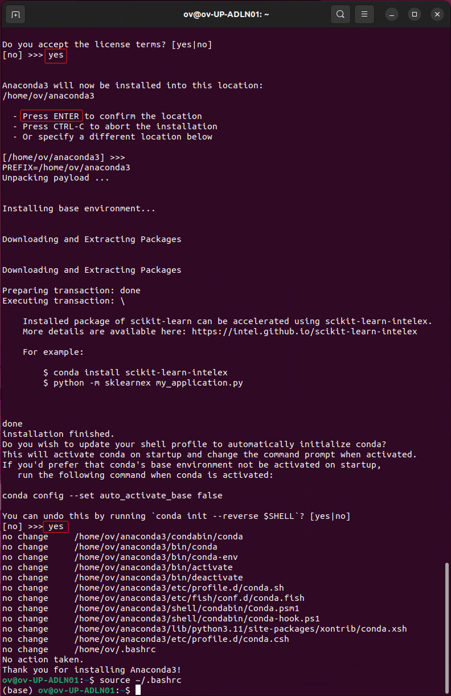
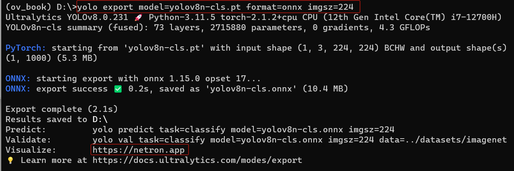
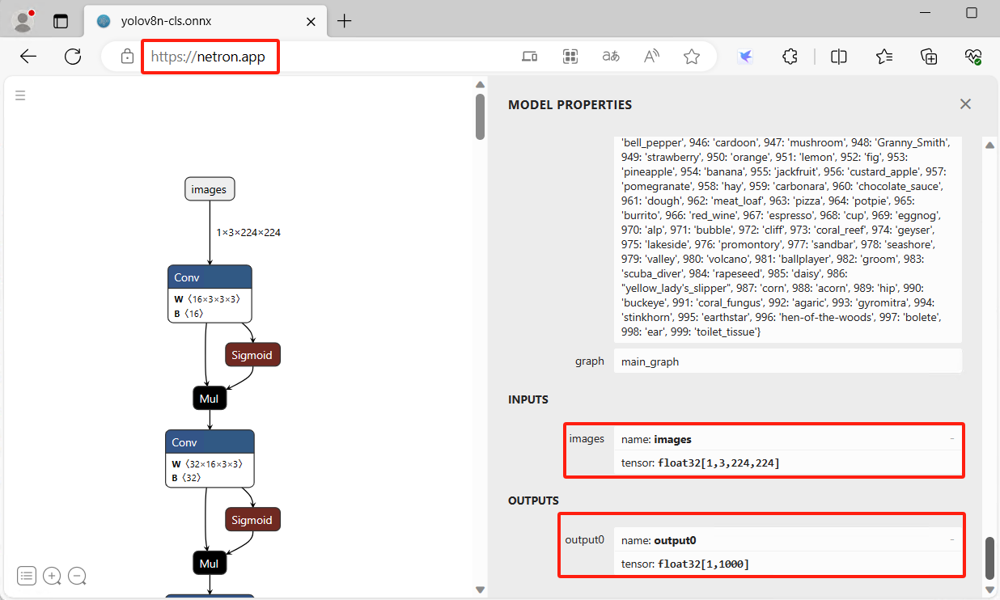

## <center>在Ubuntu上搭建OpenVINO™ Python开发环境</center>

- [在Ubuntu上搭建OpenVINO™ Python开发环境](#在ubuntu上搭建openvino-python开发环境)
  - [:tent:简介](#tent简介)
  - [:factory:安装并配置Anaconda](#factory安装并配置anaconda)
  - [:stars:下载并安装Git](#stars下载并安装git)
  - [:speedboat:安装ultralytics并导出yolov8n-cls.onnx模型](#speedboat安装ultralytics并导出yolov8n-clsonnx模型)
  - [:rocket:安装OpenVINO™ 工具套件](#rocket安装openvino-工具套件)
  - [:whale:安装VS Code](#whale安装vs-code)


### :tent:简介
本文将从零开始详述在Ubuntu22.04上搭建OpenVINO™ Python开发环境。

###  :factory:安装并配置Anaconda
**第一步**，下载并安装**Anaconda**

Anaconda([官方网站](https://www.anaconda.com/))是Python软件包(packages)和虚拟环境(virtual environment)的管理工具，让Python开发者能方便快捷地管理Python运行的虚拟环境和开发应用程序所依赖的各种软件包。

从[Anaconda官网](https://www.anaconda.com/download#downloads)下载最新的Anaconda3-xxxx.xx-x-Linux-x86_64.sh安装文件，或者使用命令：
```
curl -O https://repo.anaconda.com/archive/Anaconda3-2023.09-0-Linux-x86_64.sh
```

然后执行：
```
bash ~/Downloads/Anaconda3-2023.09-0-Linux-x86_64.sh
```
在[阅读并接受license agreement](https://docs.anaconda.com/free/anaconda/install/linux/)后，所有步骤按默认配置键入“Enter”或“yes”即可完成安装。


<div align=center></div>

看到"Thank you for installing Anaconda3!"字样后，键入命令，激活conda:
```
source ~/.bashrc
```

**第二步**， 配置Anaconda国内镜像源

参考[Anaconda 镜像使用帮助](https://mirrors.tuna.tsinghua.edu.cn/help/anaconda/)，完成Anaconda国内镜像源配置，这样可以极大的提高Python软件包的下载速度。

**第三步**， 创建并激活虚拟环境ov_book

打开**Terminal** 窗口，输入命令更新当前conda
```
conda update conda
```
输入命令创建名为“ov_book"的虚拟环境
```
conda create -n ov_book python=3.11
```
激活ov_book虚拟环境
```
conda activate ov_book
```
设置阿里镜像源,提高使用pip工具下载Python软件包的速度
```python
pip config set global.index-url https://mirrors.aliyun.com/pypi/simple
pip config set install.trusted-host mirrors.aliyun.com
```

### :stars:下载并安装Git

Git是一个开源免费的分布式版本控制系统，不管是小项目还是大项目，都可以高效的管理。本书主要用Git工具从GitHub克隆项目代码仓，例如：[YOLOv8代码仓](https://github.com/ultralytics/ultralytics)。

安装git命令
```
sudo apt-get udpate
sudo apt-get install git
git --version
```

### :speedboat:安装ultralytics并导出yolov8n-cls.onnx模型

**第一步**，打开 *Terminal* 窗口，使用*conda activate ov_book*激活*ov_book*虚拟环境，然后执行命令：
```
pip install ultralytics
```

**第二步**，导出yolov8n-cls.onnx模型
```
yolo export model=yolov8n-cls.pt format=onnx imgsz=224
```
<div align=center></div>

**第三步**，学会使用netron查看模型

根据上图的提示，进入[https://netron.app](https://netron.app),打开yolov8n_cls.onnx模型，查看模型信息，尤其是输入和输出。
<div align=center></div>

### :rocket:安装OpenVINO™ 工具套件

OpenVINO™ 工具套件包含：OpenVINO™ Runtime，OpenVINO™ Model Converter和benchmark_app，使用命令安装**OpenVINO™ 工具套件**和[Intel Graphics Compute Runtime](https://github.com/intel/compute-runtime)：
```
pip install openvino  #安装OpenVINO™工具套件
sudo apt-get install intel-opencl-icd  #安装compute-runtime
```
验证安装：
```
python -c "from openvino.runtime import Core; print(Core().available_devices)"
ovc -h
benchmark_app -h
```

### :whale:安装VS Code

Visual Studio Code 是一款功能强大的代码编辑器，非常适合跟Anaconda和Git一起，作为Python程序的集成开发环境(IDE)。

从[VS Code官网](https://code.visualstudio.com/)下载安装文件，按照默认选项完成安装。

到此，**在Ubuntu22.04上搭建OpenVINO™ Python开发环境已完成！**


