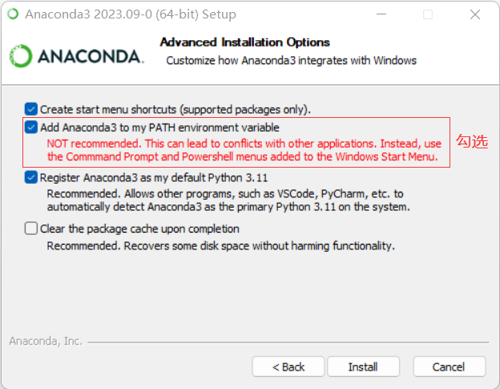

## <center>在Windows上搭建OpenVINO™ Python开发环境</center>

- [在Windows上搭建OpenVINO™ Python开发环境](#在windows上搭建openvino-python开发环境)
  - [:tent:简介](#tent简介)
  - [:factory:安装并配置Anaconda](#factory安装并配置anaconda)
  - [:stars:下载并安装Git](#stars下载并安装git)
  - [:speedboat:安装ultralytics并导出yolov8n-cls.onnx模型](#speedboat安装ultralytics并导出yolov8n-clsonnx模型)
  - [:rocket:安装openvino python软件包](#rocket安装openvino-python软件包)
  - [:oncoming\_automobile:安装VS Code](#oncoming_automobile安装vs-code)


### :tent:简介
本文将从零开始详述在Windows10/11上搭建OpenVINO™ Python开发环境。

###  :factory:安装并配置Anaconda
**第一步**，下载并安装**Anaconda**

Anaconda([官方网站](https://www.anaconda.com/))是Python软件包(packages)和虚拟环境(virtual environment)的管理工具，让Python开发者能方便快捷地管理Python运行的虚拟环境和开发应用程序所依赖的各种软件包。

从[Anaconda官网](https://www.anaconda.com/)下载最新的Anaconda安装文件，双击安装。

所有安装选项页面均保持默认选择，但在"Advanced Installation Options"页， 请勾选“Add Anaconda3 to my PATH environment variable”，让Anaconda成为Windows系统默认的Python运行版本。

<div align=center></div>

**第二步**， 配置Anaconda国内镜像源

参考[Anaconda 镜像使用帮助](https://mirrors.tuna.tsinghua.edu.cn/help/anaconda/)，完成Anaconda国内镜像源配置，这样可以极大的提高Python软件包的下载速度。

注意: Windows 用户无法直接创建名为 .condarc 的文件，可先执行 conda config --set show_channel_urls yes 生成该文件之后再修改

**第三步**， 创建并激活虚拟环境ov_book

打开**命令提示符** 窗口，输入命令更新当前conda
```
conda update conda
```
输入命令创建名为“ov_book"的虚拟环境
```
conda create -n ov_book python=3.11
```
激活ov_book虚拟环境
```
conda activate ov_book
```
设置阿里镜像源,提高使用pip工具下载Python软件包的速度
```python
pip config set global.index-url https://mirrors.aliyun.com/pypi/simple
pip config set install.trusted-host mirrors.aliyun.com
```

### :stars:下载并安装Git

Git是一个开源免费的分布式版本控制系统，不管是小项目还是大项目，都可以高效的管理。本书主要用Git工具从GitHub克隆项目代码仓，例如：[YOLOv8代码仓](https://github.com/ultralytics/ultralytics)。

从[Git官网](https://git-scm.com/downloads)下载Git安装文件，按默认选项安装即可。

### :speedboat:安装ultralytics并导出yolov8n-cls.onnx模型

**第一步**，打开 *命令提示符* 窗口，使用*conda activate ov_book*激活*ov_book*虚拟环境，然后执行命令：
```
pip install ultralytics
```

**第二步**，导出yolov8n-cls.onnx模型
```
yolo export model=yolov8n-cls.pt format=onnx imgsz=224
```

### :rocket:安装openvino python软件包

OpenVINO Python软件包包含：OpenVINO Runtime，OpenVINO Model Converter和benchmark_app，使用命令安装openvino：
```
pip install openvino
```
验证安装：
```
python -c "from openvino.runtime import Core; print(Core().available_devices)"
ovc -h
benchmark_app -h
```

### :oncoming_automobile:安装VS Code

Visual Studio Code 是一款功能强大的代码编辑器，非常适合跟Anaconda和Git一起，作为Python程序的集成开发环境(IDE)。

从[VS Code官网](https://code.visualstudio.com/)下载安装文件，按照默认选项完成安装。

到此，**在Windows10/11上搭建OpenVINO™ Python开发环境已完成！**


